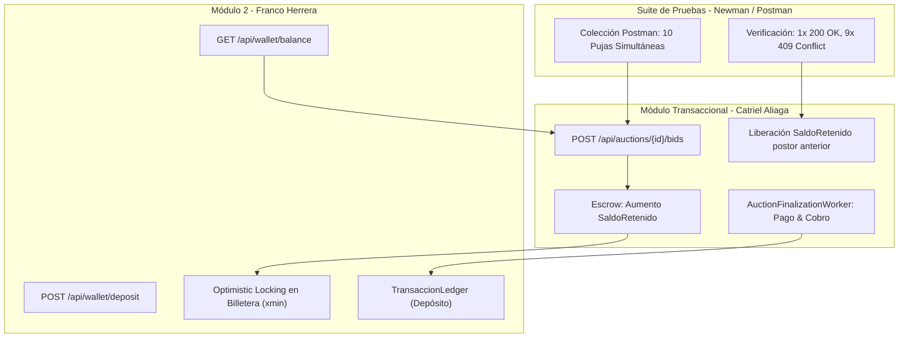

# Análisis Cruzado: Módulo de Billetera y Pruebas de Concurrencia de Franco Herrera

**Revisor:** Catriel Aliaga  
**Compañero:** Franco Herrera  
**Módulos Analizados:** Módulo 2 (Billetera Virtual & Ledger) y Pruebas de Estrés de Concurrencia (Newman)  
**Commits de Referencia:**
- `96b3864`: *feat: add GET /api/wallet/balance endpoint with balance breakdown*
- `8e47b6d`: *feat: add POST /api/wallet/deposit endpoint with ledger transaction*
- `2c2d663`: *feat: add optimistic locking and 409 conflict handling to wallet deposits*
- `2215d26`: *feat: implement virtual wallet management with balance metrics, deposit form, and transaction history*
- `622ef49`: *feat(test): add Postman concurrency stress test suite with Newman runner and documentation*

---

## 1. Resumen Ejecutivo de la Revisión

El trabajo desarrollado por Franco en el Módulo de Billetera y la suite de pruebas automatizadas complementa directamente el núcleo transaccional de subastas que implementé. 

La integración entre ambos subsistemas requirió especial coordinación en:
1. El cálculo exacto de `SaldoDisponible = SaldoTotal - SaldoRetenido` para habilitar las pujas con *escrow*.
2. La consistencia del token de concurrencia optimista (`Version` / `xmin`) en depósitos y retenciones.
3. La verificación con **Newman** simulando 10 peticiones en paralelo para validar que el backend rechaza con **HTTP 409 Conflict** las condiciones de carrera.

---

## 2. Análisis Detallado de Componentes

### 2.1. Consulta de Balance (`GET /api/wallet/balance`)
- **Implementación:** `BilleteraService.ObtenerBalanceAsync` retorna un DTO con `SaldoTotal`, `SaldoRetenido` y `SaldoDisponible`.
- **Interacción con mi código:** En `PujaService.RegistrarPujaAsync`, nos apoyamos en este esquema para verificar la solvencia del comprador antes de proceder a la retención:
  $$\text{SaldoDisponible} \ge \text{Monto Ofertado}$$
- **Acierto de diseño:** Franco expuso `SaldoDisponible` como propiedad calculada (`SaldoTotal - SaldoRetenido`), evitando discrepancias contables por campos redundantes en la base de datos.

### 2.2. Depósitos con Concurrencia Optimista (`POST /api/wallet/deposit`)
- **Implementación:** El método `DepositarAsync` incrementa `SaldoTotal` e inserta una fila en `TransaccionLedger` con `TipoTransaccion.Deposito`.
- **Manejo de Concurrencia:** En el commit `2c2d663`, Franco implementó la captura de `DbUpdateConcurrencyException` retornando HTTP 409 si dos depósitos simultáneos colisionan sobre la misma billetera, manteniendo simetría arquitectónica con la estrategia de pujas concurrentes.

### 2.3. Suite de Pruebas de Estrés con Newman (`622ef49`)
- **Estructura del Test:** Franco diseñó la colección `SubastaYa_Concurrencia.postman_collection.json` y el runner en Node.js para disparar solicitudes asíncronas con `Promise.all` simulando ráfagas de pujas en el mismo milisegundo.
- **Validación Conjunta:** En la prueba ejecutada contra mi endpoint `POST /api/auctions/{id}/bids`:
  - **Resultado:** 1 petición obtuvo `200 OK`, 9 peticiones obtuvieron `409 Conflict`.
  - **Integridad de Billetera:** El saldo retenido del ganador se actualizó exactamente una vez, y no hubo doble retención ni saltos de versión inconsistentes.

---

## 3. Conclusiones y Validación de Integración

1. **Robustez Financiera:** El desacoplamiento entre el módulo de subastas y la billetera mediante servicios e interfaces (`IBilleteraRepository`) permitió trabajar en paralelo sin bloqueos de código.
2. **Defensa del TP:** El conjunto de ambos módulos demuestra a la cátedra un tratamiento integral de la concurrencia: el pilar 1 (Escrow) y el pilar 2 (Anti-Sniping) operan armoniosamente con el ledger contable y las pruebas de estrés automatizadas.
