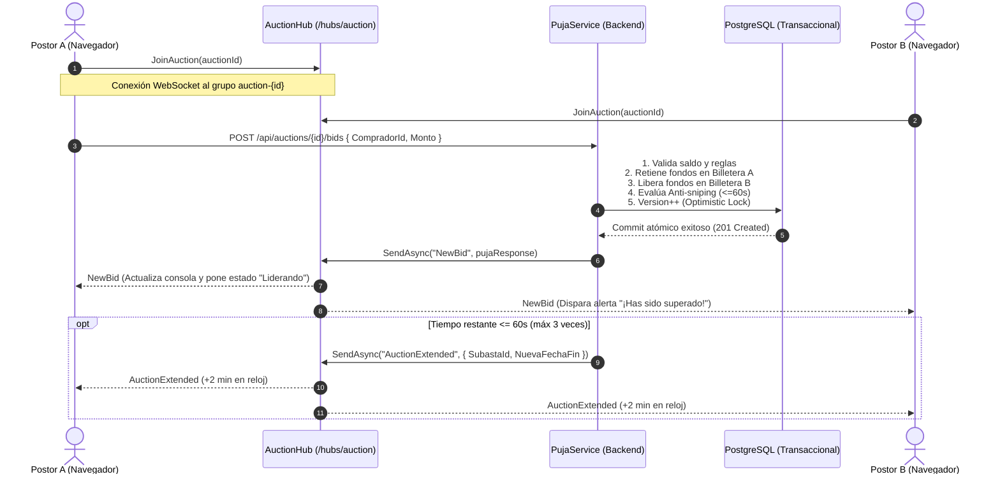

# Documentación Técnica: Sala de Subastas en Vivo (Módulo 3)

**Autor:** Catriel Aliaga  
**Módulo:** Módulo 3 — Live Bidding Room  
**Tecnologías:** SignalR (ASP.NET Core 9), WebSockets, React 19, Tailwind CSS, Lucide Icons  
**Commits de Referencia:** `f532c54`, `ef1d3f8`

---

## 1. Arquitectura de Comunicación en Tiempo Real

Para proveer una experiencia fluida y reactiva en la subasta sin sobrecargar la base de datos ni depender de sondeos periódicos (*polling*), el sistema utiliza **SignalR** sobre **WebSockets** persistentes con reconexión automática en el cliente.



---

## 2. Componentes del Backend

### 2.1. `AuctionHub.cs`
El hub gestiona la suscripción y desuscripción de conexiones por sala virtual:
```csharp
public class AuctionHub : Hub
{
    public async Task JoinAuction(int auctionId)
    {
        await Groups.AddToGroupAsync(Context.ConnectionId, $"auction-{auctionId}");
    }

    public async Task LeaveAuction(int auctionId)
    {
        await Groups.RemoveFromGroupAsync(Context.ConnectionId, $"auction-{auctionId}");
    }
}
```

### 2.2. Eventos Difundidos por SignalR
| Evento | Origen | Payload | Descripción |
|---|---|---|---|
| `NewBid` | `PujaService.cs` | `PujaResponse` | Notifica nueva puja aceptada con importe, seudónimo y estado. |
| `AuctionExtended` | `PujaService.cs` | `{ SubastaId, NuevaFechaFin }` | Notifica prórroga de $+2\text{ minutos}$ por anti-sniping. |
| `AuctionStarted` | `AuctionFinalizationWorker.cs` | `{ SubastaId, Estado, FechaInicio, FechaFin }` | Notifica activación de subasta programada. |
| `AuctionFinalized` | `AuctionFinalizationWorker.cs` | `{ SubastaId, Estado, GanadorId, MontoFinal }` | Notifica cierre con adjudicación y ganador. |
| `AuctionDeserted` | `AuctionFinalizationWorker.cs` | `{ SubastaId, Estado: "Desierta" }` | Notifica cierre sin postores. |
| `BidRejected` | `PujaService.cs` | `{ SubastaId, Motivo }` | Feedback informativo de rechazo. |

---

## 3. Componentes del Frontend (`SubastaYaFront`)

### 3.1. Hook de Conexión (`use-auction-hub.js`)
Administra el ciclo de vida de la conexión WebSocket con `@microsoft/signalr`:
- `withAutomaticReconnect([0, 2000, 5000, 10000])`: Reintento progresivo ante micro-cortes.
- Manejo de listeners: `NewBid`, `AuctionExtended`, `BidRejected`, `AuctionFinalized`, `AuctionDeserted`.
- Al reconectar: reinvoca automáticamente `JoinAuction(auctionId)`.

### 3.2. Consola de Ofertas (`BiddingConsole.jsx`) y `useBidding.js`
- Sugiere la siguiente puja válida: $\text{Oferta Máxima} + \text{Incremento Mínimo}$.
- Prohibición estricta de autopuja si el usuario autenticado es el vendedor.
- Validación de saldo local antes de disparar la llamada a la API.
- Manejo explícito del código HTTP **409 Conflict** para actualizar la pantalla sin crash.

### 3.3. Temporizador y Anti-Sniping (`LiveTimer.jsx`)
- Descuenta segundo a segundo con sincronización horaria basada en UTC del servidor.
- Animación de pulsación en rojo al entrar en los últimos 60 segundos.
- Recepción de `AuctionExtended` actualiza reactivamente el `targetDate` sin requerir recargar la página.
