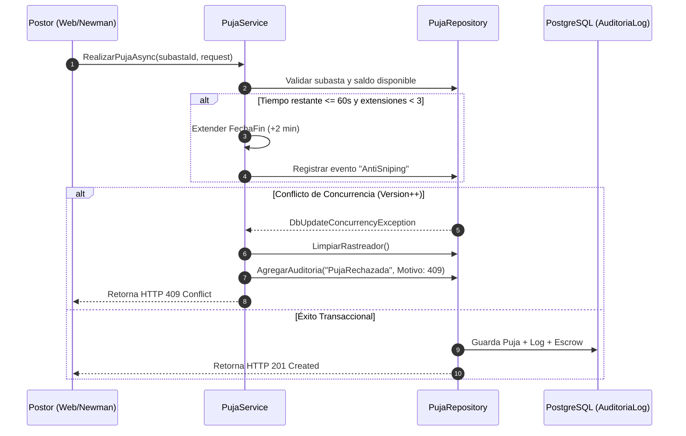

# Plan de Implementación: Regla Anti-Sniping y Auditoría Polimórfica de Eventos

**Autor:** Catriel Aliaga  
**Módulo:** Transaccional y Auditoría (Pilar 2 y Requisito 3.4)  
**Commits Asociados:**
- `b636ddd`: *feat: add anti-sniping rule*
- `a828567`: *feat: add audit logging for bids, rejections and anti-sniping*
- `d65c89d`: *feat: add audit logging for wallet deposits (item 3.4 compliance)*

---

## 1. Contexto y Objetivos del Requisito

El pliego de condiciones de la cátedra establece dos exigencias críticas:
1. **Regla Anti-Sniping (Pilar 2):** Si un participante puja en los últimos instantes de una subasta ($\le 60\text{ segundos}$), el tiempo debe extenderse automáticamente ($+2\text{ minutos}$, con tope de 3 extensiones) para garantizar una competencia justa y evitar bots de último segundo (*snipers*).
2. **Auditoría de Eventos Críticos (Punto 3.4):** Todo evento significativo debe quedar registrado de forma inmutable en la tabla `auditoria_logs`: pujas aceptadas, pujas rechazadas con su motivo (saldo insuficiente, monto inferior, subasta inactiva, concurrencia 409), extensiones por anti-sniping y depósitos de billetera.

---

## 2. Arquitectura de la Solución



---

## 3. Plan de Tareas Ejecutadas

### Fase 1: Lógica de Anti-Sniping (`b636ddd`)
- [x] Extender `PujaResponse.cs` para incluir los flags booleanos `FueAntiSniping` y `NuevaFechaFin`.
- [x] En `PujaService.cs`, calcular la ventana crítica con constantes seguras:
  ```csharp
  private const int UmbralAntiSnipingSegundos = 60;
  private const int ExtensionAntiSnipingMinutos = 2;
  private const int MaxExtensionesAntiSniping = 3;

  var tiempoRestante = subasta.FechaFin - ahora;
  if (tiempoRestante.TotalSeconds <= UmbralAntiSnipingSegundos)
  {
      var extensionesPrevias = await _pujaRepository.ContarExtensionesAntiSnipingAsync(subasta.Id);
      if (extensionesPrevias < MaxExtensionesAntiSniping)
      {
          subasta.FechaFin = subasta.FechaFin.AddMinutes(ExtensionAntiSnipingMinutos);
          fueAntiSniping = true;
      }
  }
  ```
- [x] Persistir la nueva `FechaFin` de manera atómica con la puja.
- [x] Emitir el evento `AuctionExtended` por SignalR.

### Fase 2: Registro de Auditoría de Pujas y Rechazos (`a828567`)
- [x] Incorporar `AgregarAuditoria(AuditoriaLog log)` en `IPujaRepository` y `PujaRepository`.
- [x] Auditar causas de rechazo con serialización JSON en `DetalleJson`:
  - Subasta no encontrada o inactiva.
  - Vendedor intentando autopujarse.
  - Monto inferior a la oferta mínima requerida.
  - Saldo disponible insuficiente.
- [x] Manejo de `DbUpdateConcurrencyException`:
  ```csharp
  catch (DbUpdateConcurrencyException)
  {
      _pujaRepository.LimpiarRastreador();
      await RegistrarRechazoAsync(subastaId, request, "Conflicto de concurrencia: otro usuario modificó los datos simultáneamente.");
      throw;
  }
  ```

### Fase 3: Auditoría de Depósitos Manuales (`d65c89d`)
- [x] Extender `IBilleteraRepository` y `BilleteraRepository` con `AgregarAuditoria(AuditoriaLog log)`.
- [x] En `BilleteraService.DepositarAsync`, registrar `Accion = "DepositoManual"` con montos previos y posteriores para cumplimiento estricto del punto 3.4.

---

## 4. Criterios de Aceptación Verificados

1. Toda puja ingresada a falta de $\le 60\text{ s}$ extiende el vencimiento en 2 minutos adicionales (hasta 3 veces).
2. Cada intento fallido de puja genera una fila en `auditoria_logs` detallando el motivo exacto del rechazo.
3. Un conflicto de concurrencia optimista (409) limpia el estado sucio de EF Core (`LimpiarRastreador()`) y persiste el log sin fallar.
4. Los depósitos de saldo quedan auditados con timestamp UTC y datos del titular.
