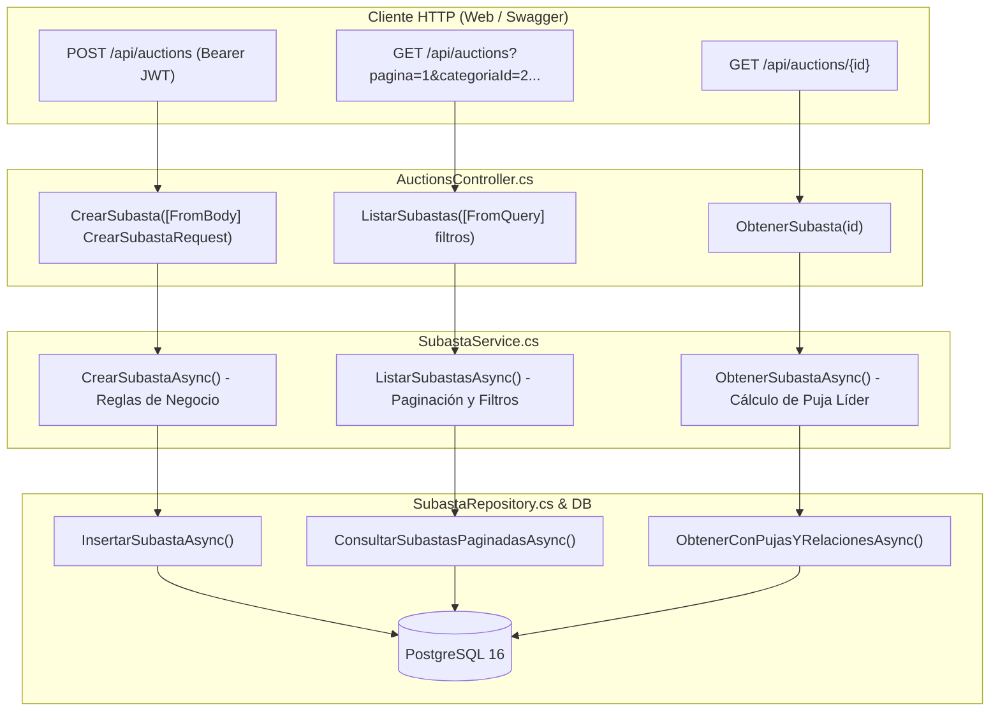

# Plan de Implementación: API de Catálogo, Filtros y Alta de Subastas

**Autor:** Catriel Aliaga  
**Módulo:** Módulo 1 de la Consigna (Catálogo, Filtros y Creación de Subastas)  
**Rama de Trabajo:** `feature/auctions-api`  
**Commits Asociados:**
- `8c40385`: *feat: add create auction endpoint with validation*
- `c6f2a2e`: *feat: add GET auctions listing endpoint with pagination and filters*
- `9da493a`: *feat: add GET auction detail endpoint with current bid*

---

## 1. Descripción del Objetivo

Diseñar e implementar en el backend (.NET 9 Web API) los endpoints centrales para la gestión de subastas del sistema **SubastaYa**:
1. `POST /api/auctions`: Permitir a un usuario autenticado como vendedor publicar un nuevo lote en subasta, validando reglas de precios, fechas en UTC y categorización.
2. `GET /api/auctions`: Permitir a los usuarios explorar el catálogo público con soporte de paginación y filtros multicriterio (por estado, categoría, rango de precio `precioMin`/`precioMax`, ordenamiento y búsqueda por título).
3. `GET /api/auctions/{id:int}`: Consultar la ficha técnica completa de una subasta específica, exponiendo el precio actual más alto, el postor líder anonimizado y el token `Version` necesario para la concurrencia optimista.

---

## 2. Decisiones de Diseño Previas

> [!IMPORTANT]
> **Validación de Fechas en Tiempo Universal (UTC)**:
> La fecha de finalización (`FechaFin`) debe ser estrictamente posterior a la fecha de inicio (`FechaInicio`) y ambas deben estar en el futuro respecto al momento de creación (`DateTime.UtcNow`). Si la fecha de inicio es inmediata, la subasta se creará en estado `Activa`; si es futura, en estado `Programada`.

> [!NOTE]
> **Separación entre DTOs de Listado y Detalle**:
> - `SubastaListadoResponse`: Optimizado para el catálogo general con los campos esenciales de presentación en tarjeta (Id, Titulo, PrecioBase, MontoActual, UrlImagen, FechaFin, Estado).
> - `SubastaDetalleResponse`: Enriquecido para la sala en vivo y la ficha técnica, incluyendo la descripción completa, el identificador y nombre del vendedor, el nombre de la categoría, el historial resumido y el token de concurrencia `Version`.

---

## 3. Arquitectura y Flujo de Componentes



---

## 4. Cambios Propuestos

### 4.1. Modelos y DTOs de Entrada y Salida

#### [NEW] `SubastaYa/Models/Dtos/Requests/CrearSubastaRequest.cs`
```csharp
namespace SubastaYa.Models.Dtos.Requests;

public class CrearSubastaRequest
{
    [Required(ErrorMessage = "El título es obligatorio.")]
    [StringLength(200, MinimumLength = 3, ErrorMessage = "El título debe tener entre 3 y 200 caracteres.")]
    public string Titulo { get; set; } = string.Empty;

    [Required(ErrorMessage = "La descripción es obligatoria.")]
    [StringLength(1000, ErrorMessage = "La descripción no puede exceder 1000 caracteres.")]
    public string Descripcion { get; set; } = string.Empty;

    [Required(ErrorMessage = "La URL de la imagen es obligatoria.")]
    [Url(ErrorMessage = "La URL de la imagen debe ser válida.")]
    public string UrlImagen { get; set; } = string.Empty;

    [Range(0.01, double.MaxValue, ErrorMessage = "El precio base debe ser mayor a 0.")]
    public decimal PrecioBase { get; set; }

    [Range(0.01, double.MaxValue, ErrorMessage = "El incremento mínimo debe ser mayor a 0.")]
    public decimal IncrementoMinimo { get; set; }

    [Required(ErrorMessage = "La fecha de inicio es obligatoria.")]
    public DateTime FechaInicio { get; set; }

    [Required(ErrorMessage = "La fecha de fin es obligatoria.")]
    public DateTime FechaFin { get; set; }

    [Range(1, int.MaxValue, ErrorMessage = "La categoría seleccionada no es válida.")]
    public int CategoriaId { get; set; }

    // Asignado internamente desde el Claim del usuario autenticado
    [JsonIgnore]
    public int VendedorId { get; set; }
}
```

#### [NEW] `SubastaYa/Models/Dtos/Responses/SubastaResponse.cs` y `SubastaDetalleResponse.cs`
Contratos para emitir respuestas tipadas al cliente incluyendo `Version` para el control de concurrencia.

---

### 4.2. Capa de Acceso a Datos y Repositorio

#### [NEW] `SubastaYa/Repositories/Interfaces/ISubastaRepository.cs`
```csharp
public interface ISubastaRepository
{
    Task<Subasta> CrearSubastaAsync(Subasta subasta);
    Task<(List<Subasta> Items, int Total)> ObtenerSubastasAsync(
        int pagina, int tamaño, EstadoSubasta? estado, int? categoriaId, 
        string? busqueda, decimal? precioMin, decimal? precioMax, string? ordenamiento);
    Task<Subasta?> ObtenerSubastaAsync(int id);
    Task<bool> ExisteCategoriaAsync(int categoriaId);
}
```

---

### 4.3. Capa de Servicios y Reglas de Negocio

#### [NEW] `SubastaYa/Services/SubastaService.cs`
- Validación de fecha: `request.FechaFin <= request.FechaInicio` $\rightarrow$ lanza `BusinessRuleException`.
- Validación de categoría: `!await _subastaRepository.ExisteCategoriaAsync(...)` $\rightarrow$ lanza `NotFoundException`.
- Cálculo de estado inicial: `ahora >= request.FechaInicio ? EstadoSubasta.Activa : EstadoSubasta.Programada`.
- Determinación de puja líder al consultar por ID: `subasta.Pujas.OrderByDescending(p => p.Monto).FirstOrDefault()`.

---

### 4.4. Controlador REST

#### [NEW] `SubastaYa/Controllers/AuctionsController.cs`
- Endpoint `POST /api/auctions` decorado con `[Authorize]`, extrayendo `ClaimTypes.NameIdentifier` para asignar `request.VendedorId`.
- Endpoints `GET /api/auctions` y `GET /api/auctions/{id:int}` decorados con `[AllowAnonymous]`.

---

## 5. Checklist de Tareas de Implementación

- [ ] **Paso 1:** Crear los DTOs de petición y respuesta en `Models/Dtos/Requests` y `Models/Dtos/Responses`.
- [ ] **Paso 2:** Definir la interfaz `ISubastaRepository` y programar su implementación en `SubastaRepository.cs` con Entity Framework Core.
- [ ] **Paso 3:** Definir la interfaz `ISubastaService` y programar las reglas de validación en `SubastaService.cs`.
- [ ] **Paso 4:** Crear `AuctionsController.cs` con inyección de dependencias y mapeo de excepciones a códigos de estado HTTP (`201`, `200`, `400`, `404`).
- [ ] **Paso 5:** Registrar las interfaces y servicios en el contenedor de dependencias de `Program.cs`.
- [ ] **Paso 6:** Ejecutar pruebas manuales y verificar respuestas en Swagger UI.

---

## 6. Plan de Verificación Previsto

1. **Prueba de Creación Exitosa (201 Created):**
   ```bash
   curl -X POST http://localhost:5080/api/auctions \
     -H "Authorization: Bearer <TOKEN_VALIDO>" \
     -H "Content-Type: application/json" \
     -d '{
       "titulo": "Notebook Gamer RTX 4080",
       "descripcion": "Excelente estado en caja",
       "urlImagen": "https://img.com/notebook.png",
       "precioBase": 150000,
       "incrementoMinimo": 5000,
       "fechaInicio": "2026-09-08T10:00:00Z",
       "fechaFin": "2026-09-15T18:00:00Z",
       "categoriaId": 1
     }'
   ```
   *Respuesta esperada:* `HTTP 201 Created` con el ID generado y estado asignado.

2. **Prueba de Validación de Fechas Inválidas (400 BadRequest):**
   Enviar `fechaFin` anterior a `fechaInicio`. La API debe rechazar la operación con mensaje `"La fecha de finalización debe ser posterior a la fecha de inicio."`.

3. **Prueba de Exploración Paginada (200 OK):**
   Consultar `GET /api/auctions?pagina=1&tamaño=5&estado=Activa` y verificar que el payload contenga la lista de subastas y metadatos de paginación (`totalPaginas`, `totalRegistros`).
