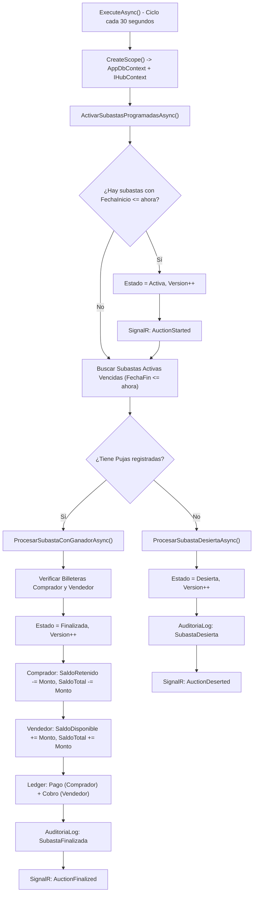

# Plan de Implementación: Background Worker de Cierre y Liquidación de Subastas

**Autor:** Catriel Aliaga  
**Módulo:** Automatización de Ciclo de Vida y Liquidación Financiera  
**Commits Asociados:**
- `7d60e65`: *feat: add auction finalization background worker*
- `6f06230`: *fix: correct wallet balance and transaction types in auction finalization*
- `8a818e2`: *fix: prevent auction finalization without wallets*
- `c605b31`: *fix: activate scheduled auctions automatically*

---

## 1. Justificación y Objetivos Técnicos

El ciclo de vida de una subasta debe transicionar de forma totalmente desatendida y confiable:
1. **Activación Automática:** Subastas con estado `Programada` cuya `FechaInicio` ya fue alcanzada deben pasar a `Activa` y emitir la señalización en tiempo real vía WebSockets (`AuctionStarted`).
2. **Cierre y Liquidación Financiera:** Al expirar la `FechaFin` de una subasta `Activa`, el sistema debe ejecutar atómicamente la transferencia de fondos (cerrar el *escrow*), debitar el saldo retenido al ganador, acreditarlo como disponible al vendedor, registrar las transacciones contables en `TransaccionLedger` y emitir el evento `AuctionFinalized`.
3. **Manejo de Subastas Desiertas:** Si vence sin ofertas, marcarla como `Desierta` (`EstadoSubasta.Desierta`) y emitir `AuctionDeserted` sin alterar balances financieros.

---

## 2. Arquitectura del Worker

---

## 3. Desglose de Fases de Desarrollo

### Fase 1: Creación del BackgroundService (`7d60e65`)
- [x] Crear `AuctionFinalizationWorker : BackgroundService` en `SubastaYa/Workers/`.
- [x] Configurar ciclo periódico cada 30 segundos (`TimeSpan.FromSeconds(30)`).
- [x] Manejo de dependencias por ámbito (`IServiceProvider.CreateScope()`) para instanciar `AppDbContext` e `IHubContext<AuctionHub>`.
- [x] Registrar el hosted service en `Program.cs`: `builder.Services.AddHostedService<AuctionFinalizationWorker>();`.

### Fase 2: Corrección de Balances y Tipos de Transacción (`6f06230`)
- [x] Corregir impacto en balances:
  - El comprador ya tenía el saldo apartado en `SaldoRetenido`. Al finalizar, se reduce tanto `SaldoRetenido` como `SaldoTotal`.
  - El vendedor recibe el dinero incrementando tanto `SaldoDisponible` como `SaldoTotal`.
- [x] Ajustar `TipoTransaccion`: El comprador asienta `TipoTransaccion.Pago` y el vendedor asienta `TipoTransaccion.Cobro`.

### Fase 3: Protección contra Billeteras Inexistentes (`8a818e2`)
- [x] Agregar validación nula para `billeteraComprador` y `billeteraVendedor`. Si por inconsistencia previa falta alguna, registrar error en el log estructurado y abortar la liquidación para salvaguardar la integridad.

### Fase 4: Activación Automática de Subastas Programadas (`c605b31`)
- [x] Implementar `ActivarSubastasProgramadasAsync` para transicionar automáticamente de `EstadoSubasta.Programada` a `EstadoSubasta.Activa`.
- [x] Emitir `AuctionStarted` a través de SignalR (`hubContext.Clients.Group($"auction-{subasta.Id}").SendAsync(...)`).

---

## 4. Criterios de Aceptación

1. Cero intervención humana requerida para iniciar o finalizar subastas.
2. Integridad atómica: La subasta solo pasa a `Finalizada` si los fondos del ganador y vendedor se asientan correctamente.
3. Notificaciones push inmediatas a todos los usuarios conectados en la sala en vivo cuando una subasta comienza (`AuctionStarted`), finaliza con ganador (`AuctionFinalized`) o queda desierta (`AuctionDeserted`).
