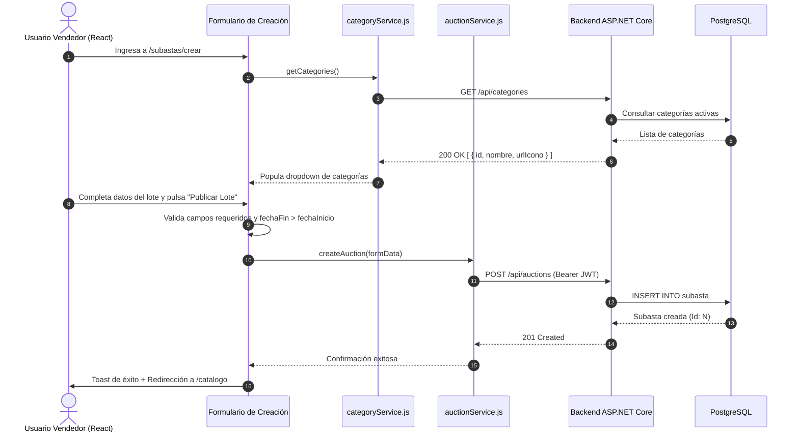

# Plan de Implementación: API de Categorías e Integración de Alta de Subastas en Frontend

**Autor:** Catriel Aliaga  
**Módulo:** Módulo 5 de la Consigna (Publicación y Taxonomía de Lotes)  
**Ramas de Trabajo:** `feature/frontend-auction-creation`, `feature/catalog-auction-creation`  
**Commits Asociados:**
- `034b4d6`: *feat: add categories endpoint*
- `28fc646`: *feat: integrate auction creation with catalog*

---

## 1. Descripción del Objetivo

Completar el flujo integral de creación de subastas conectando el backend con la interfaz de usuario en React:
1. Diseñar el endpoint público `GET /api/categories` en ASP.NET Core para exponer el listado taxonómico de categorías disponibles.
2. Desarrollar el servicio cliente `categoryService.js` en React para alimentar selectores y menús desplegables.
3. Integrar el formulario interactivo de publicación de lotes con validaciones del lado del cliente (título, precio base, fecha de inicio/fin, selección de categoría y previsualización de imágenes).
4. Vincular la acción de publicación exitosa con una redirección fluida al catálogo general o a la ficha del lote creado.

---

## 2. Decisiones de Diseño

> [!NOTE]
> **Consumo Asíncrono de Categorías**:
> El selector de categorías en el formulario de creación no debe depender de valores estáticos o cableados (*hardcoded*). Se recuperará directamente del backend mediante `categoryService.getCategories()` en un hook `useEffect` al montar el componente.

> [!IMPORTANT]
> **Conversión de Fechas Local a UTC**:
> El control `<input type="datetime-local">` captura la fecha en el huso horario del navegador del usuario. Antes de remitir el payload JSON al endpoint `POST /api/auctions`, se convertirá a formato ISO 8601 en UTC (`new Date(fechaLocal).toISOString()`), asegurando que el backend procese el ciclo de vida sin desfasajes de zona horaria.

---

## 3. Arquitectura y Flujo de Interacción



---

## 4. Cambios Propuestos

### 4.1. Endpoint de Categorías en Backend

#### [NEW] `SubastaYa/Controllers/CategoriesController.cs`
```csharp
[ApiController]
[Route("api/categories")]
public class CategoriesController : ControllerBase
{
    private readonly ICategoriaService _categoriaService;

    public CategoriesController(ICategoriaService categoriaService)
    {
        _categoriaService = categoriaService;
    }

    [HttpGet]
    [AllowAnonymous]
    [ProducesResponseType(typeof(IReadOnlyList<CategoriaResponse>), StatusCodes.Status200OK)]
    public async Task<ActionResult<IReadOnlyList<CategoriaResponse>>> Listar(CancellationToken cancellationToken)
    {
        var categorias = await _categoriaService.ListarAsync(cancellationToken);
        return Ok(categorias);
    }
}
```

---

### 4.2. Servicios e Integración en Frontend

#### [NEW] `SubastaYaFront/src/services/categoryService.js`
Módulo cliente para el fetching de categorías con manejo de errores centralizado.

#### [MODIFY] Formulario de Creación de Subastas
- Incorporación de estados para `categorias`, `isLoading` y `error`.
- Renderizado reactivo de `<option key={cat.id} value={cat.id}>{cat.nombre}</option>`.
- Previsualización dinámica de la imagen ingresada vía URL.
- Despacho de la petición de alta con feedback visual inmediato (spinner de carga en el botón de submit).

---

## 5. Checklist de Tareas

- [ ] **Paso 1:** Implementar `ICategoriaRepository` y `ICategoriaService` en el backend.
- [ ] **Paso 2:** Crear `CategoriesController.cs` exponiendo `GET /api/categories`.
- [ ] **Paso 3:** Crear `SubastaYaFront/src/services/categoryService.js`.
- [ ] **Paso 4:** Conectar el selector del formulario de creación con la llamada a la API de categorías.
- [ ] **Paso 5:** Validar conversión a UTC en los campos `fechaInicio` y `fechaFin`.
- [ ] **Paso 6:** Comprobar la redirección al catálogo tras la publicación exitosa.

---

## 6. Plan de Verificación Previsto

1. **Consulta de Categorías con curl:**
   ```bash
   curl -X GET http://localhost:5080/api/categories
   ```
   *Respuesta esperada:* Array JSON con categorías (Tecnología, Vehículos, Arte, etc.).
2. **Prueba End-to-End desde el Navegador:**
   - Iniciar sesión con un usuario vendedor.
   - Abrir el formulario de publicación y constatar que el desplegable muestre las categorías de la base de datos.
   - Completar el formulario y enviar: verificar que se genere la subasta en la base de datos y la interfaz redirija al catálogo mostrando la nueva publicación.
