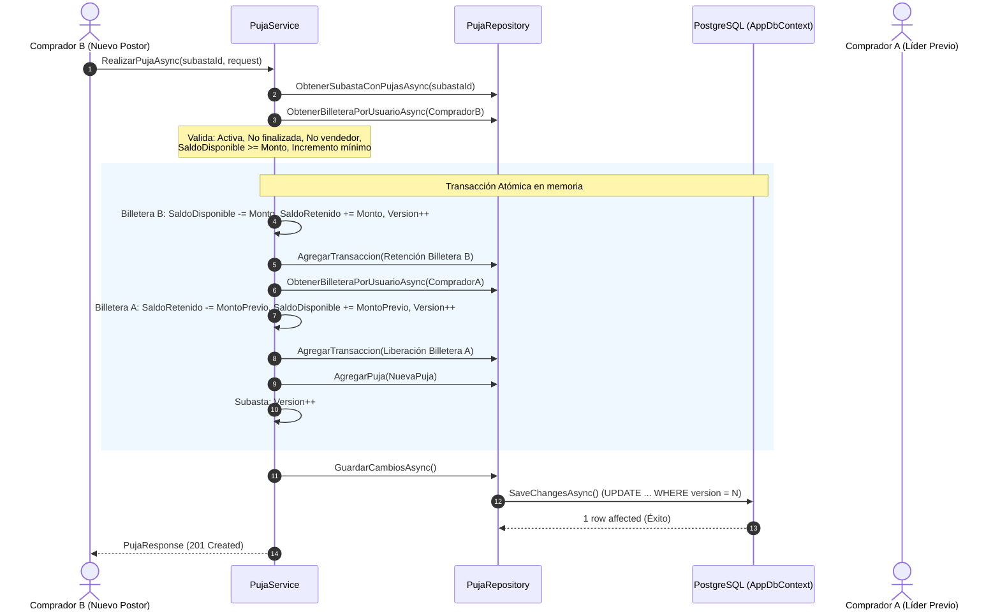

# Plan de Implementación: Escrow Financiero y Motor de Pujas Concurrentes

**Autor:** Catriel Aliaga  
**Commits Asociados:** [`f8802d6`](https://github.com/fraan221/subastaYa/commit/f8802d6), [`9e1e0f8`](https://github.com/fraan221/subastaYa/commit/9e1e0f8)  
**Módulo:** Motor de Pujas, Billetera y Ledger Transaccional  
**Tecnologías:** ASP.NET Core Web API, Entity Framework Core 10, PostgreSQL 16, Concurrencia Optimista  

---

## 1. Objetivo

Diseñar e implementar el núcleo transaccional del sistema **SubastaYa**: el endpoint `POST /api/auctions/{id}/bids`, garantizando:
1. **Garantía Escrow Obligatoria:** Ningún usuario puede ofertar si su `SaldoDisponible` no cubre el 100% de la oferta.
2. **Retención y Liberación Atómica:** En un único commit de base de datos se inmovilizan los fondos del nuevo postor y se liberan de inmediato los del postor superado, asentando cada movimiento en el libro contable `TransaccionLedger`.
3. **Concurrencia Optimista:** Prevención de carreras y sobreescrituras mediante el campo `Version` con `[ConcurrencyCheck]`, respondiendo con HTTP `409 Conflict`.
4. **Validaciones de Competencia:** El vendedor no puede ofertar en su propia subasta, el postor líder no puede sobrepujarse a sí mismo, y el monto debe superar la oferta actual más el incremento mínimo reglamentario.

---

## 2. Arquitectura Transaccional del Escrow



---

## 3. Especificación de Componentes

### 3.1. DTO de Entrada (`CrearPujaRequest.cs`)
```csharp
public class CrearPujaRequest
{
    [Required(ErrorMessage = "El ID del comprador es obligatorio.")]
    [Range(1, int.MaxValue, ErrorMessage = "El ID del comprador debe ser mayor a 0.")]
    public int CompradorId { get; set; }

    [Required(ErrorMessage = "El monto de la puja es obligatorio.")]
    [Range(0.01, double.MaxValue, ErrorMessage = "El monto de la puja debe ser mayor a 0.")]
    public decimal Monto { get; set; }
}
```

### 3.2. Contrato del Repositorio (`IPujaRepository.cs`)
```csharp
public interface IPujaRepository
{
    Task<Subasta?> ObtenerSubastaConPujasAsync(int subastaId);
    Task<Billetera?> ObtenerBilleteraPorUsuarioAsync(int usuarioId);
    Task<bool> ExisteUsuarioAsync(int usuarioId);
    void AgregarPuja(Puja puja);
    void AgregarTransaccion(TransaccionLedger transaccion);
    void AgregarAuditoria(AuditoriaLog auditoria);
    void LimpiarRastreador();
    Task GuardarCambiosAsync();
}
```

### 3.3. Algoritmo de Negocio en `PujaService.cs`
1. **Validación de Identidad:** Verificar existencia del comprador y de la subasta.
2. **Validación Temporal y Estado:** `subasta.Estado == EstadoSubasta.Activa` y `DateTime.UtcNow < subasta.FechaFin`.
3. **Validación de Postor:** `subasta.VendedorId != request.CompradorId`.
4. **Validación de Monto:**
   - Si no hay ofertas previas: `request.Monto >= subasta.PrecioBase`.
   - Si hay ofertas previas: `request.Monto >= ultimaPuja.Monto + subasta.IncrementoMinimo` y `ultimaPuja.CompradorId != request.CompradorId`.
5. **Retención de Saldo (Billetera Nuevo Postor):**
   ```csharp
   billeteraComprador.SaldoDisponible -= request.Monto;
   billeteraComprador.SaldoRetenido += request.Monto;
   billeteraComprador.Version++;
   ```
6. **Liberación de Saldo (Billetera Postor Anterior):**
   ```csharp
   if (ultimaPuja != null)
   {
       var billeteraAnterior = await _pujaRepository.ObtenerBilleteraPorUsuarioAsync(ultimaPuja.CompradorId);
       billeteraAnterior.SaldoRetenido -= ultimaPuja.Monto;
       billeteraAnterior.SaldoDisponible += ultimaPuja.Monto;
       billeteraAnterior.Version++;
   }
   ```
7. **Control de Concurrencia:** `subasta.Version++` y guardado atómico con `SaveChangesAsync()`.

---

## 4. Plan de Verificación

1. **Test de Saldo Insuficiente:**
   - Intentar ofertar $50.000 con un usuario que posee $500 de saldo disponible.
   - Resultado esperado: HTTP `400 Bad Request` con mensaje *"Saldo insuficiente"*.
2. **Test de Sobrepuja de Sí Mismo:**
   - Un usuario con la puja líder intenta ofertar de nuevo.
   - Resultado esperado: HTTP `400 Bad Request` con mensaje *"Ya posees la puja más alta en esta subasta"*.
3. **Test de Concurrencia (Dos peticiones en el mismo milisegundo):**
   - Una petición retorna HTTP `201 Created` y la otra HTTP `409 Conflict`.
   - El saldo de la billetera y la versión de la subasta permanecen consistentes.
