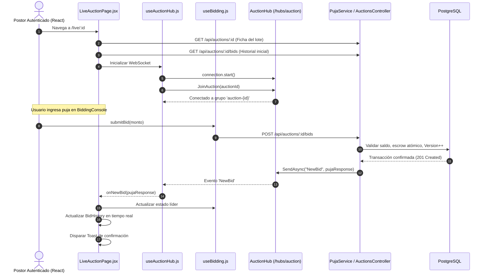

# Plan de Implementación: Sala de Subastas en Vivo en Tiempo Real (Live Auction Room Fullstack)

**Autor:** Catriel Aliaga  
**Módulo:** Módulo 3 de la Consigna (Live Bidding Room & Real-Time UX)  
**Rama de Trabajo:** `feat/live-auction-room`  
**Commit de Referencia:** [`ef1d3f8`](https://github.com/fraan221/subastaYa/commit/ef1d3f8) — *feat: implement live auction room with real-time SignalR bidding* (34 archivos, +1577 líneas)

---

## 1. Descripción del Objetivo

Transformar la experiencia estática de subastas en una **Sala de Pujas en Vivo Multi-Usuario en Tiempo Real**:
1. Proveer un canal de comunicación persistente bidireccional sobre WebSockets utilizando ASP.NET Core SignalR (`/hubs/auction`).
2. Diseñar una interfaz reactiva en React 19 compuesta por un panel orquestador (`LiveAuctionPage.jsx`), una consola de oferta con inhibición para el vendedor (`BiddingConsole.jsx`), un feed cronológico de postores anonimizados (`BidHistory.jsx`), un temporizador sincronizado con servidor (`LiveTimer.jsx`) y notificaciones flotantes de estado (`AuctionAlerts.jsx`).
3. Incorporar detección reactiva de superación de oferta (*Outbid Detection*) mediante el hook `useBidding.js`.
4. Extender el backend con el endpoint `GET /api/auctions/{id:int}/bids` para inicializar el feed histórico, anonimización por seudónimos (`Postor #ID`), límite de 3 extensiones por anti-sniping y persistencia protegida ante fallos transitorios.

---

## 2. Decisiones de Diseño y Principios de Arquitectura

> [!IMPORTANT]
> **Detección Desacoplada de Outbid (Sobrepuja)**:
> Cuando un cliente recibe el evento WebSocket `NewBid`, el hook `useBidding` compara el `CompradorId` entrante con el usuario autenticado. Si el usuario lideraba previamente la subasta y el nuevo comprador es un tercero, se activa de forma instantánea el estado de alerta:
> - Insignia visual pasa de verde **"Liderando"** a rojo **"Superado"**.
> - Se dispara un toast sonoro/visual invitando a ofertar nuevamente.
> - La consola recalcula automáticamente la siguiente oferta mínima recomendada.

> [!NOTE]
> **Privacidad y Anonimización de Postores**:
> Para garantizar la privacidad de los participantes según las buenas prácticas de plataformas de subastas, los nombres reales y correos nunca se transmiten públicamente en el canal SignalR. En su lugar, `PujaService.GenerarSeudonimo` genera una etiqueta determinística: `Postor #{compradorId}`. El frontend reconoce si el postor coincide con el usuario autenticado para añadir la insignia `"Tú"`.

> [!NOTE]
> **Resiliencia de Red y Re-suscripción Automática**:
> Micro-cortes de red no deben expulsar al postor de la subasta. El cliente SignalR se inicializa con `withAutomaticReconnect([0, 2000, 5000, 10000])`. Al dispararse el evento `onreconnected`, el hook invoca automáticamente `JoinAuction(Number(auctionId))` para restituir la membresía al grupo en el servidor sin recargar la página.

---

## 3. Arquitectura y Flujo de Interacción



---

## 4. Componentes a Desarrollar (Frontend y Backend)

### 4.1. Componentes Frontend (`SubastaYaFront/src/components/live/`)

#### [NEW] `LiveAuctionPage.jsx`
Orquestador central de la sala de subastas:
- Carga paralela de ficha técnica (`auctionService.getAuctionById`) e historial (`bidService.getBidHistory`).
- Gestión de estado para `subasta`, `pujas`, `usuarioId`, `isSeller`, `alertaOutbid`.
- Integración armoniosa con `LiveTimer`, `BiddingConsole`, `BidHistory` y `AuctionAlerts`.

#### [NEW] `use-auction-hub.js`
Hook de infraestructura de WebSockets:
```javascript
export function useAuctionHub(auctionId, callbacks = {}) {
  // Manejo de conexión con HubConnectionBuilder
  // Listeners: 'NewBid', 'AuctionExtended', 'AuctionFinalized', 'AuctionDeserted', 'BidRejected'
  // Re-suscripción en 'onreconnected': invoke('JoinAuction', Number(auctionId))
}
```

#### [NEW] `use-bidding.js`
Hook de lógica competitiva:
- Mantiene la oferta mínima requerida: `montoActual + incrementoMinimo`.
- Expone función `handleQuickBid(incremento)`.
- Maneja el ciclo de vida del estado de sobrepuja (*Outbid Detection*).
- Captura errores HTTP `409 Conflict` traduciéndolos a mensajes amigables para el usuario.

#### [NEW] `bidding-console.jsx`
Consola de oferta con botones rápidos:
- Botones de incremento configurable (`+$1.000`, `+$5.000`, `+$10.000`).
- Campo de monto libre validado con `precioMinimo`.
- **Inhibición estricta del vendedor:** Si `usuarioId === subasta.vendedorId`, el formulario se inhabilita por completo con el mensaje: *"Eres el vendedor de esta subasta. No puedes participar en las pujas."*.
- **Control de solvencia:** Bloqueo del botón si el monto excede el `saldoDisponible` del usuario.

#### [NEW] `bid-history.jsx`
Feed cronológico de ofertas:
- Listado animado de pujas entrantes ordenadas por fecha descendente.
- Renderizado de seudónimo (`Postor #ID`), importe formateado y hora local.
- Badges visuales: `"Líder actual"` para la puja más alta y `"Tú"` si pertenece al usuario en sesión.

#### [NEW] `live-timer.jsx`
Temporizador sincronizado:
- Cálculo segundo a segundo respecto a `subasta.fechaFin`.
- Detección de zona crítica ($\le 60\text{ s}$): activa tipografía roja con animación pulsante.
- Recepción de `AuctionExtended` suma $+2\text{ minutos}$ de forma fluida.

#### [NEW] `auction-alerts.jsx`
Sistema de alertas toast:
- Feedback para: *Puja aceptada*, *Has sido superado (Outbid)*, *Tiempo extendido por anti-sniping*, *Subasta finalizada*.

---

### 4.2. Endpoints y Lógica Backend (`SubastaYa`)

#### [NEW] `SubastaYa/Models/Dtos/Responses/PujaHistorialResponse.cs`
Contrato para la exposición pública del historial:
```csharp
namespace SubastaYa.Models.Dtos.Responses;

public class PujaHistorialResponse
{
    public int PujaId { get; set; }
    public int SubastaId { get; set; }
    public int CompradorId { get; set; }
    public string CompradorSeudonimo { get; set; } = string.Empty;
    public decimal Monto { get; set; }
    public DateTime FechaPuja { get; set; }
}
```

#### [MODIFY] `SubastaYa/Controllers/AuctionsController.cs`
Incorporar endpoint de consulta histórica:
```csharp
[HttpGet("{id:int}/bids")]
[AllowAnonymous]
[ProducesResponseType(typeof(List<PujaHistorialResponse>), StatusCodes.Status200OK)]
[ProducesResponseType(StatusCodes.Status404NotFound)]
public async Task<IActionResult> ObtenerHistorialPujas(int id, CancellationToken cancellationToken)
{
    var resultado = await _pujaService.ObtenerHistorialPujasAsync(id, cancellationToken);
    return Ok(resultado);
}
```

#### [MODIFY] `SubastaYa/Services/PujaService.cs`
- Implementar `ObtenerHistorialPujasAsync` ordenando ofertas por `Monto descending`.
- Método estático `GenerarSeudonimo(int compradorId) => $"Postor #{compradorId}"`.
- Límite estricto de extensiones anti-sniping: `MaxExtensionesAntiSniping = 3`.
- Bloque `try/catch` en `RegistrarRechazoAsync` para asegurar que fallas en auditoría no alteren el código HTTP de respuesta.

---

## 5. Checklist de Tareas de Ejecución

- [ ] **Paso 1:** Crear DTO `PujaHistorialResponse.cs` y método `ObtenerHistorialPujasAsync` en `PujaService.cs`.
- [ ] **Paso 2:** Exponer endpoint `GET /api/auctions/{id:int}/bids` en `AuctionsController.cs`.
- [ ] **Paso 3:** Instalar paquete `@microsoft/signalr` en `SubastaYaFront`.
- [ ] **Paso 4:** Implementar hook `use-auction-hub.js` con reconexión automática y listeners de eventos.
- [ ] **Paso 5:** Implementar hook `use-bidding.js` con cálculo dinámico y detección de sobrepuja.
- [ ] **Paso 6:** Desarrollar los componentes visuales: `LiveTimer`, `BiddingConsole`, `BidHistory`, `AuctionAlerts`.
- [ ] **Paso 7:** Desarrollar vista orquestadora `LiveAuctionPage.jsx` y configurar ruta `/live/:id` en `App.jsx`.
- [ ] **Paso 8:** Probar interacción bidireccional entre dos navegadores concurrentes.

---

## 6. Plan de Verificación Previsto

1. **Prueba de Historial de Pujas:**
   ```bash
   curl -X GET http://localhost:5080/api/auctions/1/bids
   ```
   *Respuesta esperada:* Lista JSON con `compradorSeudonimo: "Postor #X"`.
2. **Prueba de Inhibición de Vendedor:**
   Iniciar sesión con el usuario creador de la subasta y abrir `/live/:id`. Verificar que la consola indique que no puede ofertar.
3. **Prueba de Concurrencia en Vivo:**
   Abrir dos navegadores (Comprador 1 y Comprador 2). Al ofertar en una ventana, la otra debe actualizar el monto líder en $< 50\text{ ms}$ y mostrar la alerta *"¡Has sido superado!"*.
