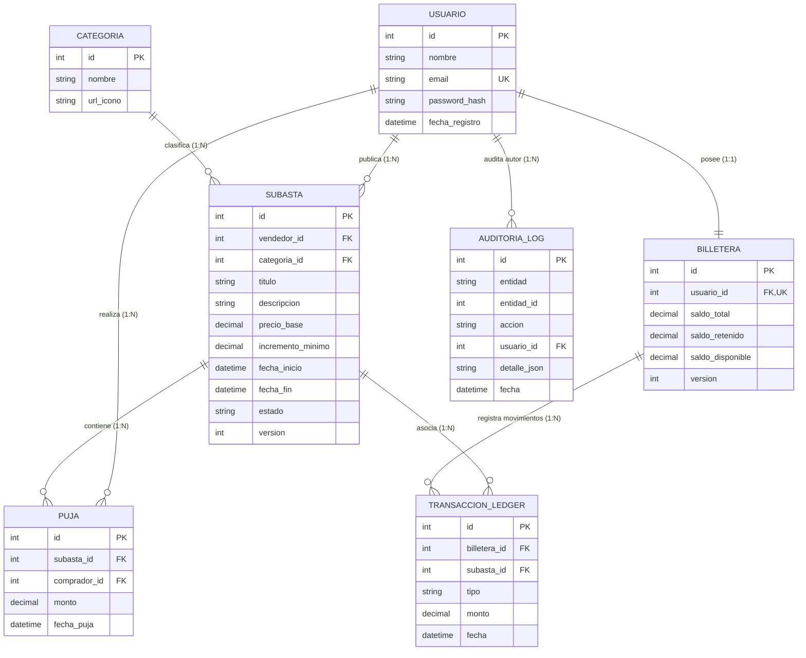

# Plan de Implementación: Modelado de Entidades de Dominio y Contexto EF Core

**Autor:** Catriel Aliaga  
**Módulo:** Capa de Datos, Dominio y Configuración de Base de Datos  
**Commits Asociados:**
- `398b8d4`: *Creacion de entidades y upgrade de appdbcontext*
- `b198c50`: *refactor(backend): initialize auction collections and enforce strict wallet relationship mapping*

---

## 1. Contexto y Objetivos del Requisito

El sistema **SubastaYa** requiere una estructura de persistencia robusta capaz de soportar operaciones transaccionales financieras (billeteras y ledger), subastas con concurrencia optimista y un registro de auditoría polimórfico inmutable:
1. **Modelado Relacional Fuerte:** Diseñar las 7 entidades centrales del dominio (`Usuario`, `Billetera`, `Subasta`, `Puja`, `Categoria`, `TransaccionLedger`, `AuditoriaLog`).
2. **Precisión Financiera Invariable:** Evitar tipos de punto flotante (`float`/`double`) y configurar precisión contable estricta con `decimal(18,2)` en saldos, montos y precios.
3. **Control de Concurrencia Optimista:** Incluir campos de versión (`Version`) en entidades transaccionales para detectar colisiones simultáneas.
4. **Mapeo Limpio y Desacoplado:** Configurar nombres de tabla y columnas explícitas mediante Fluent API en `AppDbContext.cs`, controlando las cascadas de eliminación (`DeleteBehavior.Restrict`).

---

## 2. Diagrama de Entidad-Relación (ER)

---

## 3. Desglose del Plan de Implementación

### Fase 1: Creación de Entidades de Dominio (`398b8d4`)
- [x] Crear entidad `Usuario.cs`: Definición de clave primaria entera, campos `Nombre`, `Email` (con índice único) y `PasswordHash`.
- [x] Crear entidad `Billetera.cs`: Modelar las tres dimensiones de fondos (`SaldoTotal`, `SaldoRetenido`, `SaldoDisponible`) y el token `Version`.
- [x] Crear entidad `Subasta.cs`: Atributos descriptivos, control temporal (`FechaInicio`, `FechaFin`), reglas de precio (`PrecioBase`, `IncrementoMinimo`), relación con `Categoria` y `Usuario`, y estado tipado.
- [x] Crear entidad `Puja.cs`: Vínculo entre `Subasta` y `CompradorId` con importe y marca de tiempo UTC.
- [x] Crear entidad `Categoria.cs`: Catálogo taxonómico para los lotes en subasta.
- [x] Crear entidad `TransaccionLedger.cs`: Registro inmutable del libro mayor para depósitos, retenciones, liberaciones y pagos.
- [x] Crear entidad `AuditoriaLog.cs`: Tabla centralizada polimórfica para trazabilidad de eventos de negocio.

### Fase 2: Configuración de Fluent API en `AppDbContext.cs` (`398b8d4`)
- [x] Mapear nombres de tabla explícitos en singular o plural coherente (`usuario`, `billetera`, `subasta`, `puja`, `categoria`, `transaccion_ledger`, `auditoria_log`).
- [x] Fijar tipo `decimal(18,2)` para evitar pérdidas de precisión en operaciones financieras.
- [x] Configurar conversión automática de tipos `enum` a `string` (`.HasConversion<string>()`) para mantener legibilidad en PostgreSQL.
- [x] Restringir eliminaciones en cascada peligrosas (`DeleteBehavior.Restrict`), evitando que la baja accidental de un usuario elimine transacciones o registros de auditoría.

### Fase 3: Refactorización y Consistencia de Mapeo (`b198c50`)
- [x] Inicializar colecciones de navegación en `Subasta.cs` (`public ICollection<Puja> Pujas { get; set; } = new List<Puja>();`) para evitar `NullReferenceException`.
- [x] Eliminar ambigüedades en la relación 1:1 de `BilleteraId`, retirando configuraciones contradictorias `.IsRequired(false)` sobre columnas de clave foránea primitivas no-nulas.

---

## 4. Criterios de Aceptación y Verificación

1. El modelo relacional soporta la generación de migraciones de Entity Framework Core sin advertencias de shadow properties.
2. Cada movimiento contable en `transaccion_ledger` referencia una billetera existente con integridad referencial garantizada.
3. El campo de auditoría polimórfica `entidad` + `entidad_id` permite registrar eventos cruzados (subastas, pujas, billeteras) manteniendo un esquema limpio y normalizado.
4. Las entidades transaccionales poseen campos de versión para concurrencia optimista.
