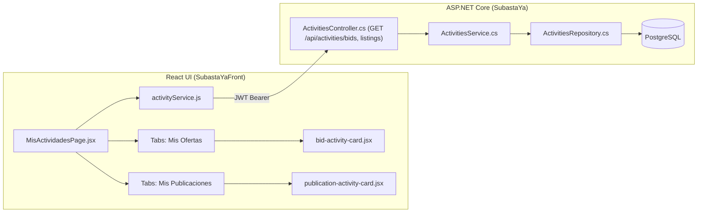

# Plan de Implementación: Módulo de Mis Actividades (Ofertas y Publicaciones)

**Autor:** Catriel Aliaga  
**Módulo:** Módulo 4 de la Consigna (Gestión de Actividades del Usuario)  
**Commits Asociados:**
- `12e8eae`: *feat: add user activities endpoints*
- `23e6ba9`: *feat: add my activities module with bids and listings views*

---

## 1. Justificación y Alcance del Requisito

El pliego de condiciones de Proyecto de Software exige que cada usuario autenticado disponga de un panel centralizado donde pueda:
1. **Monitorear sus Ofertas (Comprador):** Visualizar todas las subastas en las que ha participado, conociendo si su puja actual es la ganadora (*Ganando*), si fue superada (*Superada*), o el resultado final tras el cierre (*Ganada* o *Perdida*).
2. **Monitorear sus Publicaciones (Vendedor):** Visualizar el estado de sus subastas creadas, cantidad de pujas recibidas, oferta máxima alcanzada, fecha de fin y recaudación obtenida si ya concluyó.

---

## 2. Arquitectura Integral Backend & Frontend

---

## 3. Plan de Desarrollo por Fases

### Fase 1: API REST y Capa de Datos (`12e8eae`)
- [x] Crear DTOs de respuesta:
  - `MiPujaActividadResponse.cs` (Id, SubastaId, TituloSubasta, MiMonto, MontoActual, EstadoPuja, EstadoSubasta, FechaFin).
  - `MiPublicacionActividadResponse.cs` (Id, Titulo, PrecioInicial, PrecioReserva, MontoActual, TotalPujas, Estado, FechaFin).
  - `PaginacionResponse<T>.cs` (soporte de paginación uniforme).
- [x] Diseñar interfaces `IActivitiesRepository` e `IActivitiesService`.
- [x] Implementar `ActivitiesRepository`:
  - `ObtenerMisPujasAsync(usuarioId, pagina, tamaño)`: Agrupación o selección de la puja más alta del usuario por subasta.
  - `ObtenerMisPublicacionesAsync(usuarioId, pagina, tamaño)`: Filtro por `VendedorId == usuarioId` con inclusión de pujas.
- [x] Crear `ActivitiesController` con atributo `[Authorize]` y extracción de identidad desde los Claims (`ClaimTypes.NameIdentifier`).

### Fase 2: Interfaz Gráfica y Experiencia de Usuario (`23e6ba9`)
- [x] Crear `activityService.js` con llamadas a los endpoints de backend pasando token JWT.
- [x] Desarrollar componentes visuales:
  - `bid-activity-card.jsx`: Insignias de colores para estados (*Verde: Ganando, Amarillo: Superada, Azul: Ganada, Gris: Perdida*), acceso directo a la sala en vivo.
  - `publication-activity-card.jsx`: Estadísticas de ofertas recibidas, estado y botón de gestión.
- [x] Crear vista orquestadora `MisActividadesPage.jsx` con selector de pestañas (Tabs), paginación dinámica y loaders.
- [x] Conectar enrutamiento en `App.jsx` (`/actividades`) y enlace de navegación en `app-sidebar.jsx`.

---

## 4. Criterios de Aceptación

1. Solamente usuarios con sesión iniciada pueden consultar sus actividades (retorna 401 si no hay token).
2. La paginación responde correctamente con metadatos (`totalRegistros`, `totalPaginas`, `paginaActual`).
3. El estado de la puja refleja dinámicamente si el usuario lidera la subasta o fue sobrepujado.
4. Diseño responsivo acorde al sistema de diseño de Tailwind CSS del proyecto.
