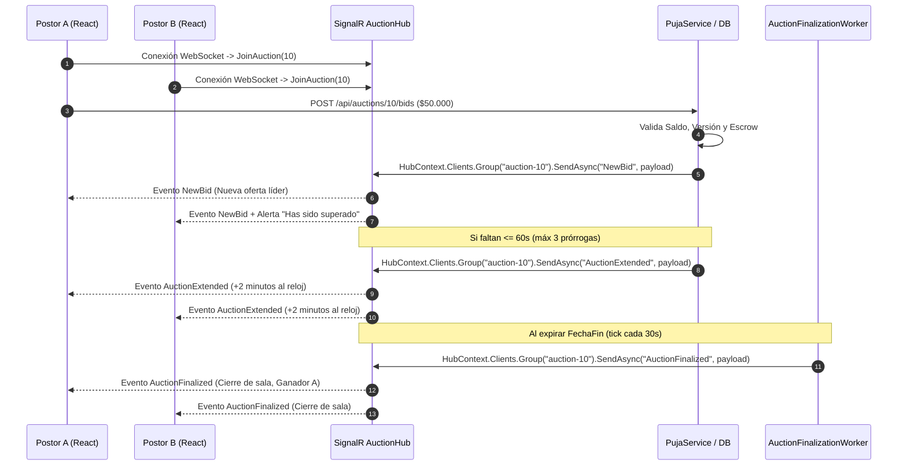

# Plan de Implementación: Sala de Subasta en Vivo en Tiempo Real (SignalR & React)

**Autor:** Catriel Aliaga  
**Módulo:** Módulo 3 de la Consigna (Experiencia en Tiempo Real con WebSockets)  
**Commits Asociados:**
- `f532c54`: *feat: add SignalR hub and real-time bid notifications*
- `ef1d3f8`: *feat: implement live auction room with real-time SignalR bidding*

---

## 1. Justificación y Objetivos Técnicos

El Módulo 3 exige que los participantes de una subasta compitan en una sala interactiva donde las ofertas, los cambios de precio y las extensiones de tiempo se reflejen **en tiempo real sin recargar la página**:
1. **Canal WebSocket Bidireccional:** Mediante ASP.NET Core SignalR (`AuctionHub`), suscribiendo a los clientes por ID entero de subasta al grupo `auction-{id}`.
2. **Emisión de Eventos Push:** Difusión instantánea de `NewBid`, `AuctionExtended`, `AuctionStarted`, `AuctionFinalized`, `AuctionDeserted` y `BidRejected`.
3. **Consola de Pujas Reactiva:** Interfaz en React con cálculo de la puja mínima ($\text{Monto Actual} + \text{Incremento Mínimo}$), validación de saldo local y bloqueo preventivo para el vendedor propietario.
4. **Resiliencia:** Reconexión automática transparente en caso de micro-cortes de red (`withAutomaticReconnect`).

---

## 2. Arquitectura de Conexión y Eventos en Vivo

---

## 3. Plan de Desarrollo por Fases

### Fase 1: Backend Hub y Señalización (`f532c54`)
- [x] Crear `AuctionHub.cs` heredando de `Hub`:
  - `JoinAuction(int auctionId)`: Suscribe la conexión al grupo `$"auction-{auctionId}"`.
  - `LeaveAuction(int auctionId)`: Desuscribe la conexión al salir de la vista.
- [x] Registrar SignalR en `Program.cs`: `builder.Services.AddSignalR();` y `app.MapHub<AuctionHub>("/hubs/auction");`.
- [x] Inyectar `IHubContext<AuctionHub>` en `PujaService` para publicar eventos de oferta aceptada (`NewBid`) y prórroga anti-sniping (`AuctionExtended`).

### Fase 2: Sala de Subasta en Frontend (`ef1d3f8`)
- [x] Instalar paquete `@microsoft/signalr` en `SubastaYaFront`.
- [x] Crear hook personalizado `use-auction-hub.js`:
  - Conexión configurada con `withAutomaticReconnect([0, 2000, 5000, 10000])`.
  - Manejo de listeners para `NewBid`, `AuctionExtended`, `AuctionFinalized`, `AuctionDeserted` y `BidRejected`.
  - Resuscripción al reconectarse: `JoinAuction(Number(auctionId))`.
- [x] Crear hook `use-bidding.js`:
  - Lógica para calcular la siguiente puja válida ($\text{Líder} + \text{Incremento Mínimo}$).
  - Detección reactiva del estado "Superado" (*Outbid*).
  - Manejo de errores 409 Concurrency Conflict.
- [x] Desarrollar componentes especializados:
  - `LiveAuctionPage.jsx`: Vista principal que reúne timer, consola, alertas e historial.
  - `BiddingConsole.jsx`: Formulario de oferta con sugerencia de monto y comprobación de saldo disponible.
  - `BidHistory.jsx`: Historial cronológico con identificador anonimizado (`Postor #ID`).
  - `LiveTimer.jsx`: Contador regresivo en tiempo real con animación crítica ($\le 60\text{ s}$).
  - `AuctionAlerts.jsx`: Mensajes emergentes de advertencia y celebración.

---

## 4. Criterios de Aceptación

1. Los clientes en una misma subasta reciben las ofertas de terceros en menos de 100 milisegundos sin refresco de página.
2. Si un usuario puja faltando menos de 60 segundos, el temporizador de todos los espectadores suma 2 minutos automáticamente (hasta 3 veces).
3. El vendedor de la subasta tiene inhabilitada la consola de puja con aviso claro de prohibición de autopuja.
4. El sistema se reconecta automáticamente ante interrupciones de red transitorias reanudando la suscripción al grupo.
