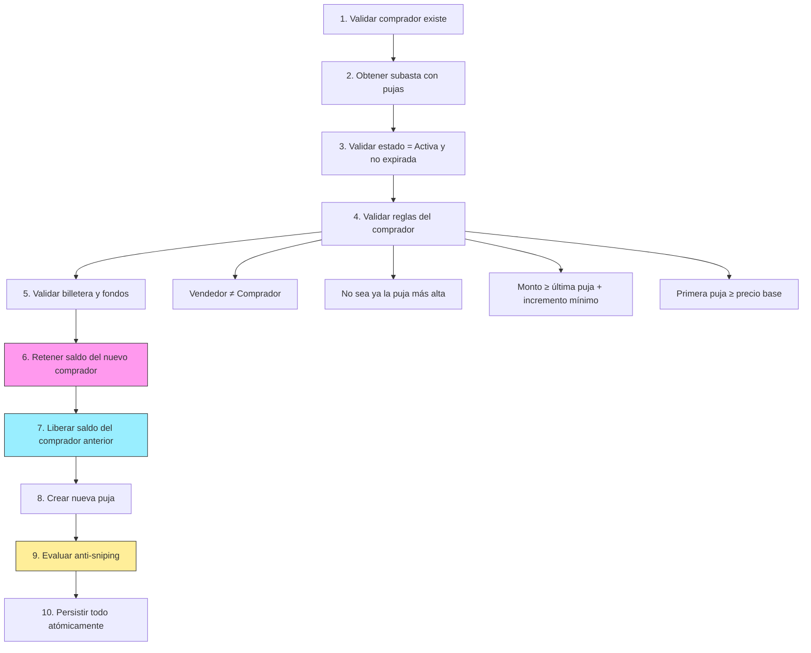

# Análisis: Cambios de tu compañero en `feature/auctions-api`

## Resumen de commits

| Commit | Descripción |
|--------|-------------|
| `9da493a` | GET `/api/auctions/{id}` — Detalle de subasta |
| `f8802d6` | POST `/api/auctions/{id}/bids` — Registro de puja con escrow y optimistic locking |
| `b636ddd` | Regla anti-sniping |
| `a828567` | Auditoría de pujas, rechazos y anti-sniping |

**13 archivos tocados, +459 líneas.** 6 archivos nuevos, 7 modificados.

---

## Endpoint 1: `GET /api/auctions/{id}` — Detalle de Subasta

### Archivos involucrados

| Archivo | Cambio |
|---------|--------|
| [SubastaDetalleResponse.cs](file:///home/fraan/Documents/Projects/SubastaYa/SubastaYa/Models/Dtos/Responses/SubastaDetalleResponse.cs) | **Nuevo** — DTO de detalle |
| [ISubastaRepository.cs](file:///home/fraan/Documents/Projects/SubastaYa/SubastaYa/Repositories/Interfaces/ISubastaRepository.cs) | +1 método |
| [SubastaRepository.cs](file:///home/fraan/Documents/Projects/SubastaYa/SubastaYa/Repositories/SubastaRepository.cs) | +`ObtenerSubastaAsync` con Includes |
| [ISubastaService.cs](file:///home/fraan/Documents/Projects/SubastaYa/SubastaYa/Services/Interfaces/ISubastaService.cs) | +1 método |
| [SubastaService.cs](file:///home/fraan/Documents/Projects/SubastaYa/SubastaYa/Services/SubastaService.cs#L55-L86) | +`ObtenerSubastaAsync` con mapeo |
| [AuctionsController.cs](file:///home/fraan/Documents/Projects/SubastaYa/SubastaYa/Controllers/AuctionsController.cs#L48-L62) | +endpoint `HttpGet("{id:int}")` |

### Cómo funciona

Es un endpoint simple: recibe `id` por ruta, busca la subasta con sus relaciones (`Vendedor`, `Categoría`, `Pujas` con `Comprador`), y devuelve un DTO enriquecido con:

- Info completa de la subasta (titulo, descripcion, precios, fechas, estado)
- `Version` (para concurrencia optimista del lado del cliente)
- `VendedorNombre` y `CategoriaNombre` (resueltos por Include)
- `MontoActual`, `UltimaPujaComprador`, `FechaUltimaPuja` — calculados de la puja más alta

✅ **Bien**: usa `{id:int}` como route constraint (solo matchea enteros), evita ambigüedad con otras rutas.

---

## Endpoint 2: `POST /api/auctions/{id}/bids` — Registro de Puja

Este es el endpoint más complejo del proyecto. Tu compañero creó una capa entera nueva (`PujaService` + `PujaRepository`) separada de `Subasta`.

### Archivos involucrados

| Archivo | Cambio |
|---------|--------|
| [CrearPujaRequest.cs](file:///home/fraan/Documents/Projects/SubastaYa/SubastaYa/Models/Dtos/Requests/CrearPujaRequest.cs) | **Nuevo** — DTO con Data Annotations |
| [PujaResponse.cs](file:///home/fraan/Documents/Projects/SubastaYa/SubastaYa/Models/Dtos/Responses/PujaResponse.cs) | **Nuevo** — Incluye `FueAntiSniping` y `NuevaFechaFin` |
| [IPujaRepository.cs](file:///home/fraan/Documents/Projects/SubastaYa/SubastaYa/Repositories/Interfaces/IPujaRepository.cs) | **Nuevo** — 7 métodos |
| [PujaRepository.cs](file:///home/fraan/Documents/Projects/SubastaYa/SubastaYa/Repositories/PujaRepository.cs) | **Nuevo** — Incluye manejo de `DbUpdateConcurrencyException` |
| [IPujaService.cs](file:///home/fraan/Documents/Projects/SubastaYa/SubastaYa/Services/Interfaces/IPujaService.cs) | **Nuevo** |
| [PujaService.cs](file:///home/fraan/Documents/Projects/SubastaYa/SubastaYa/Services/PujaService.cs) | **Nuevo** — 232 líneas, el archivo más grande |
| [AuctionsController.cs](file:///home/fraan/Documents/Projects/SubastaYa/SubastaYa/Controllers/AuctionsController.cs#L85-L109) | +endpoint POST + inyección de `IPujaService` |
| [Program.cs](file:///home/fraan/Documents/Projects/SubastaYa/SubastaYa/Program.cs) | +DI de `IPujaRepository` e `IPujaService` |

### Flujo completo de la puja (10 pasos)

### Lo que está bien hecho

✅ **Escrow (retención de saldo)**: cuando alguien puja, le retienen el monto (Disponible → Retenido). Si otro supera la puja, le liberan al anterior. Esto evita que alguien puje sin fondos.

✅ **Anti-sniping**: si la puja llega a menos de 60 segundos del cierre, extiende la subasta 2 minutos. Los valores están como constantes (`UmbralAntiSnipingSegundos`, `ExtensionAntiSnipingMinutos`), no hardcodeados en el flujo.

✅ **Concurrencia optimista**: el repo atrapa `DbUpdateConcurrencyException` y la convierte a `ConcurrencyConflictException` → el controller la mapea a HTTP `409 Conflict`. Además limpia el `ChangeTracker` para evitar estado corrupto.

✅ **Auditoría**: registra en `AuditoriaLog` tanto los rechazos de puja como las extensiones por anti-sniping, con detalle serializado en JSON.

✅ **Separación estructural**: separó `PujaService`/`PujaRepository` de `SubastaService`/`SubastaRepository`. Tiene sentido porque la lógica de pujas es muy diferente (escrow, concurrencia) al CRUD de subastas.

✅ **Data Annotations en el request**: [`CrearPujaRequest`](file:///home/fraan/Documents/Projects/SubastaYa/SubastaYa/Models/Dtos/Requests/CrearPujaRequest.cs) usa `[Required]` y `[Range]` — ASP.NET valida automáticamente antes de tocar el controller.

✅ **Patrón try/catch en el service para auditar rechazos**: [`RealizarPujaAsync`](file:///home/fraan/Documents/Projects/SubastaYa/SubastaYa/Services/PujaService.cs#L25-L46) envuelve `EjecutarPujaAsync` — si falla por cualquier regla de negocio, registra el rechazo en auditoría y re-lanza la excepción. Inteligente.

### Observaciones

> [!NOTE]
> **`Version++` manual**: en [líneas 125](file:///home/fraan/Documents/Projects/SubastaYa/SubastaYa/Services/PujaService.cs#L125) y [201](file:///home/fraan/Documents/Projects/SubastaYa/SubastaYa/Services/PujaService.cs#L201) tu compañero incrementa `Version` manualmente tanto en la billetera como en la subasta. Esto funciona correctamente con `[ConcurrencyCheck]` — EF incluye `Version` en el `WHERE` del `UPDATE`, y si otro request ya lo incrementó, el `UPDATE` afecta 0 filas → `DbUpdateConcurrencyException`. Es el mecanismo estándar de optimistic locking.

> [!NOTE]
> **Atomicidad**: todo el flujo (retención + liberación + puja + anti-sniping + auditoría) se persiste en un solo `SaveChangesAsync` al final (paso 10). Si algo falla, no se guarda nada. Correcto.

> [!NOTE]
> **El controller ahora inyecta 2 services**: [`AuctionsController`](file:///home/fraan/Documents/Projects/SubastaYa/SubastaYa/Controllers/AuctionsController.cs#L14-L21) recibe tanto `IPujaService` como `ISubastaService`. Esto es válido — un controller puede orquestar múltiples services.

---

## Resumen general

Tu compañero hizo un laburo sólido. La lógica de pujas es compleja (validaciones en cascada, escrow con dos billeteras, anti-sniping, auditoría, concurrencia) y la resolvió de forma ordenada y con buena separación de responsabilidades. Los 10 pasos del `EjecutarPujaAsync` están bien numerados y comentados, lo cual va a ayudar mucho en la defensa oral.
