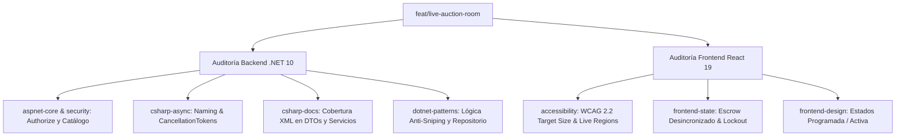

# Reporte Integral de Auditoría: Rama `feat/live-auction-room`

**Commit auditado:** [`ef1d3f8`](https://github.com/fraan221/subastaYa/commit/ef1d3f8591871b043104198ebec0ea54c36cab31) — *feat: implement live auction room with real-time SignalR bidding*  
**Autor:** Catriel Aliaga  
**Fecha:** 2026-09-20  
**Lentes de Auditoría (Skills aplicadas):** `aspnet-core`, `dotnet-best-practices`, `dotnet-design-pattern-review`, `csharp-async`, `csharp-docs`, `accessibility` (WCAG 2.2) y `frontend-design`.

---

## 1. Resumen Ejecutivo

La rama introduce la infraestructura para la **Sala de Subastas en Vivo en Tiempo Real**, vinculando un SignalR Hub con WebSockets, concurrencia optimista sobre PostgreSQL con Entity Framework Core 10, retención/liberación de fondos en garantía (*escrow*), regla anti-sniping, interfaz reactiva con React 19 / Vite / Tailwind CSS v4 y alertas dinámicas.

La auditoría exhaustiva multidisciplinaria identifica **3 defectos críticos de lógica y concurrencia**, **1 riesgo de privacidad por difusión en SignalR**, **incumplimientos de estándares C# Async y documentación XML**, y **barreras de accesibilidad WCAG 2.2** en el frontend.



---

## 2. Auditoría Backend con Skills (.NET / C#)

### 2.1. Skill: `aspnet-core` & Seguridad

#### 🔴 [CRÍTICO] `[Authorize]` a nivel clase en `AuctionsController` rompe Catálogo Público y Test de Concurrencia
* **Ubicación:** [AuctionsController.cs](file:///home/fraan/Documents/Projects/SubastaYa/SubastaYa/Controllers/AuctionsController.cs#L12-L15)
* **Diagnóstico:**
  1. La adición de `[Authorize]` sobre la clase completa `AuctionsController` bloquea los endpoints de lectura `GET /api/auctions` (catálogo principal) y `GET /api/auctions/{id}` (detalle de producto), respondiendo HTTP `401 Unauthorized` a usuarios anónimos o visitantes no logueados. Esto contradice el patrón de [CategoriesController.cs](file:///home/fraan/Documents/Projects/SubastaYa/SubastaYa/Controllers/CategoriesController.cs#L20), donde la lectura es explícitamente `[AllowAnonymous]`.
  2. **Regresión en pruebas:** El script de estrés de concurrencia documentado en el `README.md` ([run_concurrency.js](file:///home/fraan/Documents/Projects/SubastaYa/StressTest/run_concurrency.js#L26) y [SubastaYa_Stress_Test.postman_collection.json](file:///home/fraan/Documents/Projects/SubastaYa/StressTest/SubastaYa_Stress_Test.postman_collection.json)) ejecuta peticiones automáticas sin token para validar el bloqueo optimista (`201` vs `409`). Al exigir autenticación estricta en el controlador, la prueba falla inmediatamente con `401`.
  3. **Extracción insegura de identidad:**
     ```csharp
     request.VendedorId = int.Parse(User.FindFirstValue(ClaimTypes.NameIdentifier)!);
     request.CompradorId = int.Parse(User.FindFirstValue(ClaimTypes.NameIdentifier)!);
     ```
     El uso de operador *null-forgiving* `!` y `int.Parse` sin validación produce un `NullReferenceException` o `FormatException` no controlado (HTTP 500) si el claim falta o no es un entero válido, en vez de emitir un `401 Unauthorized` estructurado como hace correctamente [ActivitiesController.cs](file:///home/fraan/Documents/Projects/SubastaYa/SubastaYa/Controllers/ActivitiesController.cs#L67-L75).
* **Solución `aspnet-core`:**
  - Agregar `[AllowAnonymous]` a `ListarSubastas`, `ObtenerSubasta` y `ObtenerHistorialPujas`.
  - Emplear un método auxiliar seguro `ObtenerUsuarioId()` con `int.TryParse`:
    ```csharp
    private int? ObtenerUsuarioId()
    {
        var claim = User.FindFirstValue(ClaimTypes.NameIdentifier) ?? User.FindFirstValue("usuario_id");
        return int.TryParse(claim, out var id) ? id : null;
    }
    ```

#### 🟡 [SEGURIDAD] Fuga de información confidencial en `BidRejected` vía SignalR
* **Ubicación:** [PujaService.cs](file:///home/fraan/Documents/Projects/SubastaYa/SubastaYa/Services/PujaService.cs#L331-L337)
* **Diagnóstico:**
  ```csharp
  await _hubContext.Clients.Group($"auction-{subastaId}").SendAsync("BidRejected", new
  {
      SubastaId = subastaId,
      CompradorId = request.CompradorId,
      Motivo = motivo
  });
  ```
  Cuando una puja es rechazada por saldo insuficiente (`Saldo insuficiente. Saldo disponible: $1.000, Monto requerido: $80.000`), el backend emite el mensaje a **todo el grupo de la subasta**. Aunque la UI del cliente filtra por `targetUserId === user?.id`, la trama de WebSocket llega a las terminales de todos los participantes conectados, exponiendo saldos, IDs y motivos de rechazo en el tráfico de red.
* **Solución `aspnet-core`:** Como la solicitud de puja es un HTTP `POST`, el cliente que ofertó ya recibe el error y su motivo de forma privada en el cuerpo de la respuesta HTTP (`400 BadRequest`). La difusión de `BidRejected` a nivel grupal debe eliminarse o dirigirse únicamente al usuario que originó la petición (`_hubContext.Clients.User(...)`).

---

### 2.2. Skill: `dotnet-design-pattern-review` & `dotnet-best-practices`

#### 🔴 [CRÍTICO] Fallo lógico en el tope de extensiones Anti-Sniping (`PujaService.cs`)
* **Ubicación:** [PujaService.cs](file:///home/fraan/Documents/Projects/SubastaYa/SubastaYa/Services/PujaService.cs#L224-L230)
* **Diagnóstico:**
  ```csharp
  var extensionesPrevias = subasta.Pujas
      .Count(p => p.FechaPuja > subasta.FechaFin.AddMinutes(-ExtensionAntiSnipingMinutos * MaxExtensionesAntiSniping));

  if (extensionesPrevias < MaxExtensionesAntiSniping) { ... }
  ```
  1. La constante `ExtensionAntiSnipingMinutos * MaxExtensionesAntiSniping` equivale a `2 * 3 = 6 minutos`.
  2. La consulta cuenta **todas las pujas registradas en los últimos 6 minutos**, sin distinguir si fueron extensiones anti-sniping o pujas regulares durante el desarrollo natural de la subasta.
  3. Si 3 postores realizaron pujas ordinarias en el intervalo entre el minuto -6 y el minuto -1, `extensionesPrevias` alcanza 3. Cuando llega una puja en los últimos 60 segundos (zona crítica), **la extensión anti-sniping se bloquea inmediatamente**, sin haberse ejecutado ni una sola vez.
  4. Por el contrario, si las extensiones previas ocurrieron hace más de 6 minutos debido a sucesivas prórrogas, la condición podría volver a permitir prórrogas ilimitadas.
* **Solución de Patrón:** Consultar directamente el log de auditoría persistido (`AuditoriaLogs`) donde `Entidad == "Subasta"`, `EntidadId == subasta.Id` y `Accion == "AntiSniping"` mediante el repositorio:
  ```csharp
  // En IPujaRepository y PujaRepository
  Task<int> ContarExtensionesAntiSnipingAsync(int subastaId, CancellationToken cancellationToken = default);
  ```

#### 🔵 [DISEÑO] Ordenamiento no determinista en historial de pujas
* **Ubicación:** [PujaRepository.cs](file:///home/fraan/Documents/Projects/SubastaYa/SubastaYa/Repositories/PujaRepository.cs#L29-L31)
* **Diagnóstico:**
  ```csharp
  return await _context.Pujas
      .Include(p => p.Comprador)
      .Where(p => p.SubastaId == subastaId)
      .OrderByDescending(p => p.FechaPuja)
      .ToListAsync();
  ```
  En situaciones de concurrencia elevada o cuando dos registros comparten la misma marca temporal por truncamiento de milisegundos en base de datos, ordenar solo por `FechaPuja` produce resultados inconsistentes. En el resto del proyecto ([PujaService.cs](file:///home/fraan/Documents/Projects/SubastaYa/SubastaYa/Services/PujaService.cs#L124), [SubastaService.cs](file:///home/fraan/Documents/Projects/SubastaYa/SubastaYa/Services/SubastaService.cs#L101), [AuctionFinalizationWorker.cs](file:///home/fraan/Documents/Projects/SubastaYa/SubastaYa/Workers/AuctionFinalizationWorker.cs#L144)) se utiliza `.OrderByDescending(p => p.Monto).ThenByDescending(p => p.FechaPuja)`.
* **Recomendación:** Homogeneizar con `.OrderByDescending(p => p.FechaPuja).ThenByDescending(p => p.Id)` o por `Monto`.

---

### 2.3. Skill: `csharp-async`

#### 🟡 Omisión del sufijo `Async` en métodos asíncronos
* **Ubicación:** 
  - [PujaService.cs](file:///home/fraan/Documents/Projects/SubastaYa/SubastaYa/Services/PujaService.cs#L295): `private async Task TryLogRejection(...)`
  - [AuctionFinalizationWorker.cs](file:///home/fraan/Documents/Projects/SubastaYa/SubastaYa/Workers/AuctionFinalizationWorker.cs#L43): `private async Task ProcesarSubastasVencidas(...)`
  - [AuctionFinalizationWorker.cs](file:///home/fraan/Documents/Projects/SubastaYa/SubastaYa/Workers/AuctionFinalizationWorker.cs#L136): `private async Task ProcesarSubastaConGanador(...)`
  - [AuctionFinalizationWorker.cs](file:///home/fraan/Documents/Projects/SubastaYa/SubastaYa/Workers/AuctionFinalizationWorker.cs#L230): `private async Task ProcesarSubastaDesierta(...)`
* **Diagnóstico:** La guía de `csharp-async` especifica: *"Use the 'Async' suffix for all async methods"*.
* **Recomendación:** Renombrar a `TryLogRejectionAsync`, `ProcesarSubastasVencidasAsync`, `ProcesarSubastaConGanadorAsync` y `ProcesarSubastaDesiertaAsync`.

#### 🔵 Propagación de `CancellationToken`
* **Ubicación:** [AuctionsController.cs](file:///home/fraan/Documents/Projects/SubastaYa/SubastaYa/Controllers/AuctionsController.cs#L138), [IPujaService.cs](file:///home/fraan/Documents/Projects/SubastaYa/SubastaYa/Services/Interfaces/IPujaService.cs#L10), [IPujaRepository.cs](file:///home/fraan/Documents/Projects/SubastaYa/SubastaYa/Repositories/Interfaces/IPujaRepository.cs#L8).
* **Diagnóstico:** Los nuevos métodos `ObtenerHistorialPujasAsync` y `ObtenerHistorialPorSubastaAsync` no reciben ni propagan `CancellationToken`. En ASP.NET Core, los endpoints de consulta deben aceptar `CancellationToken cancellationToken` para abortar consultas a la base de datos si el cliente cancela la solicitud HTTP.

---

### 2.4. Skill: `csharp-docs`

#### 🟡 Falta de documentación XML en miembros públicos y etiquetas de retorno
* **Ubicación:**
  - [PujaHistorialResponse.cs](file:///home/fraan/Documents/Projects/SubastaYa/SubastaYa/Models/Dtos/Responses/PujaHistorialResponse.cs): Las propiedades `PujaId`, `SubastaId`, `CompradorId`, `CompradorSeudonimo`, `Monto`, `FechaPuja` carecen de etiquetas `<summary>`.
  - [IPujaRepository.cs](file:///home/fraan/Documents/Projects/SubastaYa/SubastaYa/Repositories/Interfaces/IPujaRepository.cs#L8): `ObtenerHistorialPorSubastaAsync` carece de comentarios XML.
  - [IPujaService.cs](file:///home/fraan/Documents/Projects/SubastaYa/SubastaYa/Services/Interfaces/IPujaService.cs#L10): `ObtenerHistorialPujasAsync` carece de comentarios XML.
  - [PujaService.cs](file:///home/fraan/Documents/Projects/SubastaYa/SubastaYa/Services/PujaService.cs#L343): `GenerarSeudonimo` no utiliza verbo en tercera persona del presente ("Genera un seudónimo...").
  - [PujaService.cs](file:///home/fraan/Documents/Projects/SubastaYa/SubastaYa/Services/PujaService.cs#L348): `ObtenerHistorialPujasAsync` carece de `<param>` y `<returns>`.
  - [SubastaDetalleResponse.cs](file:///home/fraan/Documents/Projects/SubastaYa/SubastaYa/Models/Dtos/Responses/SubastaDetalleResponse.cs#L15): `VendedorId` carece de XML docs.
  - [PujaResponse.cs](file:///home/fraan/Documents/Projects/SubastaYa/SubastaYa/Models/Dtos/Responses/PujaResponse.cs#L8): `CompradorSeudonimo` carece de XML docs.

---

## 3. Auditoría Frontend con Skills (React / UX / Accessibility)

### 3.1. Skill: `accessibility` (WCAG 2.2)

#### 🔴 [WCAG 3.3.2 - Nivel A] Falta de etiqueta programática en el formulario de puja
* **Ubicación:** [bidding-console.jsx](file:///home/fraan/Documents/Projects/SubastaYa/SubastaYaFront/src/components/live/bidding-console.jsx#L126-L134)
* **Diagnóstico:**
  ```jsx
  <Input
    type="number"
    placeholder={`Mayor a ${formatCurrency(suggestedBid)}`}
    value={customAmount}
    onChange={(e) => setCustomAmount(e.target.value)}
    ...
  />
  ```
  El campo numérico para ingresar un monto de puja personalizado **no posee un `<label>` asociado ni atributo `aria-label`**. Un `placeholder` no satisface el criterio WCAG 3.3.2 (Labels or Instructions), ya que desaparece al escribir y los lectores de pantalla pueden omitirlo.
* **Solución:** Agregar `aria-label="Monto personalizado para ofertar"` o un `<label htmlFor="custom-bid-amount" className="visually-hidden">`.

#### 🔴 [WCAG 4.1.3 - Nivel AA] Notificaciones flotantes sin región en vivo (`aria-live`)
* **Ubicación:** [auction-alerts.jsx](file:///home/fraan/Documents/Projects/SubastaYa/SubastaYaFront/src/components/live/auction-alerts.jsx#L80-L86)
* **Diagnóstico:**
  El contenedor `<div className="fixed bottom-6 right-6 ...">` renderiza toasts dinámicos para eventos críticos (*"¡Te han superado!"*, *"Regla Anti-Sniping"*, *"Oferta rechazada"*), pero **no contiene `role="status"` ni `aria-live="polite"`**.
  Los usuarios de lectores de pantalla no reciben ninguna advertencia auditiva cuando son superados por otro postor o cuando se extiende la subasta.
* **Solución:** Declarar `role="region" aria-live="polite" aria-label="Alertas de la subasta en vivo"` en el contenedor de alertas.

#### 🟡 [WCAG 2.5.8 - Nivel AA] Tamaño del botón de descarte inferior al mínimo (Target Size)
* **Ubicación:** [auction-alerts.jsx](file:///home/fraan/Documents/Projects/SubastaYa/SubastaYaFront/src/components/live/auction-alerts.jsx#L46-L52)
* **Diagnóstico:** El botón para cerrar la notificación:
  ```jsx
  <button onClick={() => onDismiss(alert.id)} className="text-white/80 hover:text-white shrink-0 p-0.5 rounded cursor-pointer" aria-label="Cerrar notificación">
    <X className="size-4" />
  </button>
  ```
  Mide aproximadamente 20 × 20 píxeles. El criterio WCAG 2.2 Target Size (Minimum) exige un área táctil mínima de **24 × 24 píxeles** (con recomendación de 44 × 44 píxeles).
* **Solución:** Ajustar padding y dimensiones mínimas (`min-w-[28px] min-h-[28px] flex items-center justify-center p-1.5`).

#### 🟡 [WCAG 2.3.3 - Nivel AAA / Buenas Prácticas] Animaciones que no respetan `prefers-reduced-motion`
* **Ubicación:** [bidding-console.jsx](file:///home/fraan/Documents/Projects/SubastaYa/SubastaYaFront/src/components/live/bidding-console.jsx#L91), [live-timer.jsx](file:///home/fraan/Documents/Projects/SubastaYa/SubastaYaFront/src/components/live/live-timer.jsx#L30)
* **Diagnóstico:** Se aplican clases `animate-bounce` y `animate-pulse` de manera permanente sin la variante `motion-reduce:animate-none`. Puede provocar mareos o desorientación en usuarios con sensibilidad vestibular.
* **Solución:** Añadir `motion-reduce:animate-none` a las clases de animación.

---

### 3.2. Skill: Ciclo de Vida y Estado React

#### 🔴 [CRÍTICO] Bloqueo por saldo desactualizado tras ser superado (*Outbid Lockout*)
* **Ubicación:** [use-bidding.js](file:///home/fraan/Documents/Projects/SubastaYa/SubastaYaFront/src/hooks/use-bidding.js#L75-L80)
* **Diagnóstico:**
  1. El postor A puja $80.000 (teniendo $100.000 en billetera). Su saldo en el cliente pasa a $20.000.
  2. El postor B puja $90.000.
  3. El backend libera la retención del postor A, devolviendo sus $80.000 al saldo disponible (saldo real en backend: $100.000).
  4. El frontend recibe `NewBid` y muestra el estado *"¡Has sido superado!"* con el nuevo botón rápido *"Pujar $95.000"*.
  5. Sin embargo, el hook `useBidding` solo refresca el saldo tras *emitir* una puja propia en `submitBid`, **nunca ante eventos entrantes de superación**. El estado `balance` sigue marcando $20.000.
  6. Al hacer clic en *"Pujar $95.000"*, el chequeo local:
     ```javascript
     if (balance !== null && amountToBid > balance) {
       throw new Error(`Saldo insuficiente: requieres $${amountToBid} pero dispones de $${balance}.`);
     }
     ```
     dispara una excepción local y **bloquea al postor**, impidiéndole responder a la puja a menos que recargue la página completa.
* **Solución:** Invocar `refreshBalance()` automáticamente cuando cambie la lista de `bids` o cuando `userStatus === 'outbid'`.

---

### 3.3. Skill: `frontend-design`

#### 🔵 Manejo de estados de Subastas Programadas
* **Ubicación:** [live-timer.jsx](file:///home/fraan/Documents/Projects/SubastaYa/SubastaYaFront/src/components/live/live-timer.jsx#L10-L15) y [bidding-console.jsx](file:///home/fraan/Documents/Projects/SubastaYa/SubastaYaFront/src/components/live/bidding-console.jsx#L37-L40)
* **Diagnóstico:**
  - Si un usuario ingresa a una subasta con estado `Programada`, `LiveTimer` ignora `fechaInicio` y cuenta regresivamente hacia `fechaFin`, dando a entender que ya está activa.
  - `BiddingConsole` solo deshabilita los botones si `estado === 'Finalizada' || estado === 'Desierta'`, permitiendo presionar *"Pujar"* en subastas que todavía no inician, lo que genera un error en el backend (`La subasta no está activa`).
* **Solución:**
  - Si `estado === "Programada"`, el cronómetro debe mostrar *"Inicia en: [conteo hacia fechaInicio]"*.
  - La consola debe deshabilitar las pujas si `auction?.estado !== "Activa"` y exhibir una tarjeta de estado: *"Subasta Programada — La sala abrirá ofertas al iniciar el evento"*.

#### 🔵 Captura del evento `AuctionStarted` en `use-auction-hub.js`
* **Ubicación:** [use-auction-hub.js](file:///home/fraan/Documents/Projects/SubastaYa/SubastaYaFront/src/hooks/use-auction-hub.js#L27-L46)
* **Diagnóstico:** El worker del backend emite el evento `AuctionStarted` cuando el reloj alcanza la fecha de inicio, pero el hook del frontend no lo escucha. Quienes esperan en la sala deben recargar la página para ver habilitada la consola.

---

## 4. Matriz Comparativa de Hallazgos

| ID | Severidad | Skill Asociada | Componente Afectado | Descripción del Problema |
|---|---|---|---|---|
| **H-01** | 🔴 Alta | `dotnet-patterns` | `PujaService.cs` | Cálculo erróneo de extensiones anti-sniping: cuenta cualquier puja ordinaria en una ventana de 6 min. |
| **H-02** | 🔴 Alta | React Lifecycle | `use-bidding.js` | Desincronización de saldo en cliente al ser superado: bloquea al usuario con falso "Saldo insuficiente". |
| **H-03** | 🔴 Alta | `aspnet-core` | `AuctionsController.cs` | `[Authorize]` a nivel clase impide navegación anónima del catálogo y rompe pruebas de estrés sin token. |
| **H-04** | 🟡 Media | `aspnet-core` / Sec | `PujaService.cs` | Fuga de privacidad: difusión de `BidRejected` con saldo y motivo a todos los conectados por SignalR. |
| **H-05** | 🔴 Alta (WCAG) | `accessibility` | `bidding-console.jsx` | Violación WCAG 3.3.2: campo de puja manual sin `<label>` ni `aria-label`. |
| **H-06** | 🟡 Media (WCAG) | `accessibility` | `auction-alerts.jsx` | Violación WCAG 4.1.3: alertas flotantes sin región en vivo (`aria-live="polite"`). |
| **H-07** | 🟡 Media (WCAG) | `accessibility` | `auction-alerts.jsx` | Violación WCAG 2.5.8: botón de cierre con tamaño interactivo menor a 24×24px. |
| **H-08** | 🔵 Baja | `csharp-async` | `PujaService` / Worker | Métodos asíncronos sin sufijo `Async` (`TryLogRejection`, `ProcesarSubastasVencidas`). |
| **H-09** | 🔵 Baja | `csharp-docs` | Varios DTOs / Repos | Comentarios XML ausentes en propiedades de DTOs y firmas de métodos de repositorio/servicio. |
| **H-10** | 🔵 Baja | `frontend-design` | `live-timer.jsx` | Subastas `Programada` calculan cronómetro con `fechaFin` y consola no bloquea botones de puja. |
| **H-11** | 🔵 Baja | `aspnet-core` | `use-auction-hub.js` | Evento `AuctionStarted` emitido por el worker no es escuchado por el hook de WebSocket. |
| **H-12** | 🔵 Baja | `dotnet-patterns` | `PujaRepository.cs` | Historial ordenado solo por fecha sin clave secundaria determinista ante marcas temporales idénticas. |

---

## 5. Plan de Acción y Correcciones Específicas

### Fase 1: Correcciones Críticas en Backend (P0)

1. **Anti-Sniping exacto:**
   - En `IPujaRepository`:
     ```csharp
     Task<int> ContarExtensionesAntiSnipingAsync(int subastaId, CancellationToken cancellationToken = default);
     ```
   - En `PujaRepository`:
     ```csharp
     public async Task<int> ContarExtensionesAntiSnipingAsync(int subastaId, CancellationToken cancellationToken = default)
     {
         return await _context.AuditoriaLogs
             .CountAsync(a => a.Entidad == nameof(Subasta) 
                           && a.EntidadId == subastaId 
                           && a.Accion == "AntiSniping", cancellationToken);
     }
     ```
   - En `PujaService`:
     ```csharp
     var tiempoRestante = subasta.FechaFin - ahora;
     if (tiempoRestante.TotalSeconds <= UmbralAntiSnipingSegundos)
     {
         var extensionesPrevias = await _pujaRepository.ContarExtensionesAntiSnipingAsync(subasta.Id);
         if (extensionesPrevias < MaxExtensionesAntiSniping)
         {
             fueAntiSniping = true;
             subasta.FechaFin = subasta.FechaFin.AddMinutes(ExtensionAntiSnipingMinutos);
             nuevaFechaFin = subasta.FechaFin;
             ...
     ```

2. **Permitir catálogo público y parseo robusto en `AuctionsController`:**
   - Aplicar `[AllowAnonymous]` a `ListarSubastas`, `ObtenerSubasta` y `ObtenerHistorialPujas`.
   - Validar identidad con método seguro:
     ```csharp
     private int? ObtenerUsuarioId()
     {
         var claim = User.FindFirstValue(ClaimTypes.NameIdentifier)
                  ?? User.FindFirstValue("usuario_id");
         return int.TryParse(claim, out var id) ? id : null;
     }
     ```

3. **Remover emisión grupal de `BidRejected`:**
   - Eliminar `_hubContext.Clients.Group(...).SendAsync("BidRejected", ...)` en `RegistrarRechazoAsync`. La respuesta HTTP ya transmite el motivo de rechazo de forma segura y privada al usuario que ofertó.

4. **Homogeneizar nombres asíncronos y orden:**
   - Renombrar `TryLogRejection` a `TryLogRejectionAsync`.
   - Ordenar historial por `OrderByDescending(p => p.FechaPuja).ThenByDescending(p => p.Id)`.

---

### Fase 2: Correcciones Críticas en Frontend (P0 / P1)

1. **Refresco automático de saldo en `use-bidding.js`:**
   ```javascript
   useEffect(() => {
     if (currentLeader?.compradorId !== currentUserId) {
       refreshBalance()
     }
   }, [currentLeader, currentUserId, refreshBalance])
   ```

2. **Accesibilidad WCAG 2.2:**
   - En `bidding-console.jsx`:
     ```jsx
     <Input
       type="number"
       aria-label="Monto personalizado para ofertar"
       placeholder={`Mayor a ${formatCurrency(suggestedBid)}`}
       ...
     />
     ```
   - En `auction-alerts.jsx`:
     ```jsx
     <div 
       role="region" 
       aria-live="polite" 
       aria-label="Alertas de la subasta"
       className="fixed bottom-6 right-6 z-50 flex flex-col gap-2.5 max-w-sm w-full pointer-events-none"
     >
     ```
   - En botón de descarte de alerta:
     ```jsx
     <button
       onClick={() => onDismiss(alert.id)}
       className="min-w-[28px] min-h-[28px] flex items-center justify-center text-white/80 hover:text-white shrink-0 p-1.5 rounded cursor-pointer"
       aria-label="Cerrar notificación"
     >
       <X className="size-4" />
     </button>
     ```
   - En animaciones:
     Añadir `motion-reduce:animate-none` junto a `animate-bounce` y `animate-pulse`.

3. **Manejo de estado `Programada`:**
   - En `LiveTimer`: si `estado === "Programada"`, usar `targetDate = fechaInicio` y rotular *"Inicia en:"*.
   - En `BiddingConsole`: deshabilitar botones si `auction?.estado !== "Activa"`.
   - En `use-auction-hub.js`: registrar listener para `AuctionStarted`.
