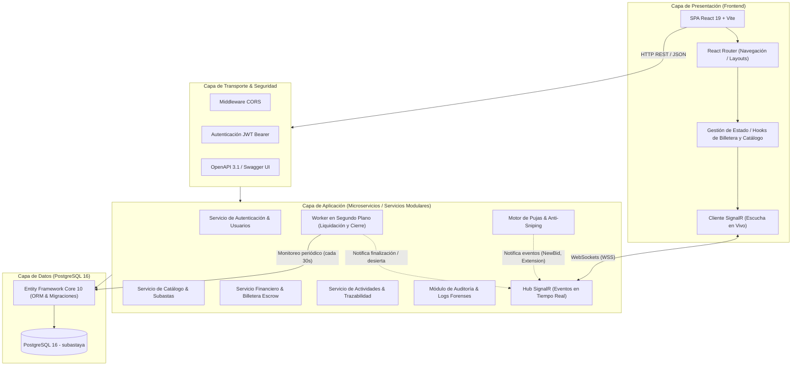
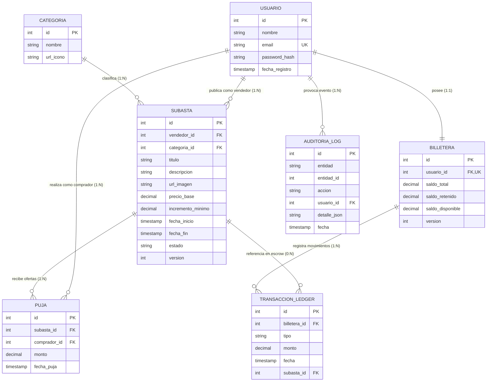

# Documentación de Software: SubastaYa

**Cátedra:** Proyecto de Software  
**Docente:** Ing. Olivera Lucas  
**Integrantes:** Herrera Franco; Aliaga Catriel  
**Proyecto:** SubastaYa – Plataforma Web de Subastas en Tiempo Real con Billetera Escrow  

---

## 1. Arquitectura

El sistema **SubastaYa** está diseñado bajo una arquitectura multicapa desacoplada y orientada a servicios/módulos independientes, garantizando alta cohesión, bajo acoplamiento, escalabilidad horizontal y consistencia transaccional bajo condiciones de alta concurrencia. 

La solución se compone de una capa de presentación desarrollada en **React 19** asistida por **Vite** y **Tailwind CSS**, una capa de aplicación y servicios basada en **ASP.NET Core Web API (.NET 10)** con comunicación bidireccional mediante **SignalR / WebSockets**, y una capa de persistencia relacional sustentada en **PostgreSQL 16**, orquestada de manera íntegra a través de contenedores **Docker Compose**.

---

### 1.1. Identificación y Rol de los Microservicios / Módulos del Ecosistema

El backend organiza su lógica de negocio en módulos autónomos y bien delimitados que pueden ser operados dentro de un monolito modular o desplegados como microservicios independientes:

1. **Módulo de Autenticación y Cuentas de Usuario (`AuthService`):**  
   Gestiona el ciclo de vida de las identidades, registro, hashing criptográfico de contraseñas y expedición de tokens de acceso **JWT (JSON Web Token)** con firmas simétricas. Provee la resolución de claims de identidad requerida por todos los endpoints protegidos del ecosistema.
2. **Módulo de Catálogo y Ciclo de Vida de Subastas (`SubastaService` & `CategoriaService`):**  
   Encargado del alta, parametrización, categorización y exploración de publicaciones. Implementa filtrado multicriterio dinámico (por estado, categoría, rango de precios monetarios y ordenamiento temporal o de cotización) junto con paginación optimizada a nivel de motor de base de datos.
3. **Módulo de Pujas y Motor de Competencia en Tiempo Real (`PujaService` & `AuctionHub`):**  
   Es el núcleo reactivo del sistema. Procesa ofertas concurrentes validando solvencia en tiempo real, incrementos mínimos reglamentarios y la regla de protección **Anti-Sniping**. Emite eventos instantáneos a través de canales de SignalR (`auction-{id}`) para actualizar las pantallas de todos los postores conectados sin refresco de página.
4. **Módulo Financiero, Billetera y Ledger Transaccional (`BilleteraService`):**  
   Implementa un modelo de **garantía transaccional (Escrow)**. Mantiene la contabilidad de tres saldos para cada usuario: *Saldo Total*, *Saldo Retenido* (comprometido en subastas activas) y *Saldo Disponible*. Administra un libro contable inmutable (`transaccion_ledger`) donde cada movimiento monetario (depósito, retención, liberación, pago o cobro) queda registrado para trazabilidad financiera.
5. **Módulo de Gestión de Actividades (`ActivitiesService`):**  
   Centraliza la experiencia histórica del usuario, segregando el panel de compras (seguimiento de pujas, posición líder o superada, estado final de adjudicación) y el panel de ventas (rendimiento de publicaciones, recaudación total y compradores adjudicados).
6. **Servicio en Segundo Plano de Liquidación Automática (`AuctionFinalizationWorker`):**  
   Servicio alojado (`IHostedService` / `BackgroundService`) que se ejecuta de forma desatendida cada 30 segundos. Evalúa subastas programadas para activarlas a su hora exacta, detecta subastas vencidas para adjudicar al ganador definitivo transfiriendo fondos entre billeteras (cerrando el ciclo Escrow), o las declara desiertas si no recibieron posturas, emitiendo las notificaciones en tiempo real pertinentes.
7. **Módulo de Auditoría y Trazabilidad Forense (`AuditoriaLog`):**  
   Registra de manera inmutable cada mutación de datos sensible (creación de subastas, pujas rechazadas, ejecuciones del algoritmo Anti-Sniping, acreditaciones de saldo y finalizaciones) almacenando un payload JSON detallado con el contexto temporal y de usuario.

---

### 1.2. Estrategia de Concurrencia y Resiliencia

Para prevenir condiciones de carrera cuando dos o más postores disparan ofertas por el mismo monto o en la misma fracción de segundo, el sistema implementa **Concurrencia Optimista** tanto en la entidad `Subasta` como en `Billetera`, mediante una columna de versión entera (`version`) con control de concurrencia nativo (`[ConcurrencyCheck]`). 

Si una transacción detecta que la versión del registro cambió durante la evaluación de la puja, la base de datos rechaza la operación disparando una excepción de concurrencia que el controlador traduce en un código HTTP `409 Conflict`, obligando al cliente a actualizar el estado más reciente y preservando la integridad del balance monetario y de las ofertas.

---

### 1.3. Base de Datos y Diagrama Entidad-Relación (DER)

El almacenamiento se realiza sobre **PostgreSQL 16**. El modelo relacional está normalizado para garantizar la integridad referencial de los fondos económicos y el historial de posturas, utilizando restricciones de borrado (`DeleteBehavior.Restrict`) en las entidades financieras y operativas clave para impedir inconsistencias de datos o pérdidas de historial transaccional.

---

## 2. Funcionalidades

A continuación se detallan todas las funcionalidades que componen la plataforma web **SubastaYa**, describiendo su comportamiento operativo, sus reglas de negocio subyacentes y la experiencia provista al usuario.

---

### Funcionalidad 1: Autenticación e Inicio de Sesión (Login)

Esta funcionalidad permite el acceso seguro de los usuarios al ecosistema de SubastaYa. Al ingresar a la plataforma sin una sesión activa, el sistema intercepta la navegación y presenta el formulario de inicio de sesión. El usuario debe ingresar su correo electrónico y su contraseña previamente registrada. 

El servicio backend valida las credenciales y devuelve un token JWT con la información de identidad del usuario (ID, nombre y correo), el cual se almacena de forma segura en el almacenamiento local del cliente y se adjunta en la cabecera `Authorization: Bearer <token>` de las solicitudes subsecuentes.

  <b>[screenshot de pantalla login]</b> 
  <i>Figura 1: Pantalla principal de autenticación y formulario de inicio de sesión de SubastaYa.</i>

Como se observa en la **Figura 1**, la interfaz presenta un formulario estilizado y responsivo. Cuando el usuario introduce credenciales no registradas o inválidas, la aplicación presenta una advertencia de error contextual sin recargar la página, tal como se ilustra en la **Figura 2**.

  <b>[screenshot de validación de error en login]</b> 
  <i>Figura 2: Alerta contextual ante credenciales erróneas o cuenta inexistente.</i>

---

### Funcionalidad 2: Exploración y Catálogo de Subastas con Filtros Avanzados

Constituye el punto de acceso central para descubrir artículos disponibles en la plataforma. Presenta una cuadrícula reactiva de tarjetas que exhibe las subastas con su fotografía, categoría, estado actual, contador temporal dinámico, precio base o puja líder vigente.

La plataforma implementa una barra de control con filtrado multifactorial que permite al postor refinar el listado de forma inmediata:
- **Filtrado por Estado:** Todas, Activas, Próximas (Programadas), Finalizadas y Desiertas.
- **Filtrado por Categoría:** Filtrado dinámico según las categorías dadas de alta en el sistema (Tecnología, Arte, Vehículos, etc.).
- **Rango de Precios:** Delimitación de montos monetarios mínimo y máximo permitidos.
- **Criterios de Ordenamiento:** Subastas más recientes, menor tiempo restante de cierre o mayor oferta registrada.
- **Paginación:** Navegación por páginas numeradas para optimizar la carga de red.

  <b>[screenshot de pantalla explorar]</b> 
  <i>Figura 3: Catálogo interactivo de subastas con grilla de publicaciones y barra superior de filtros.</i>

En la **Figura 3** se evidencia cómo cada tarjeta refleja el estado temporal del remate. Al aplicar filtros combinados (por ejemplo, subastas activas de una categoría específica dentro de un rango de precios), el catálogo se actualiza automáticamente como se visualiza en la **Figura 4**.

  <b>[screenshot de catálogo con filtros aplicados]</b> 
  <i>Figura 4: Vista del catálogo refinada mediante selectores de categoría y rango de precios.</i>

---

### Funcionalidad 3: Publicación y Creación de Nuevas Subastas

Permite a cualquier usuario registrado actuar como vendedor y publicar un lote o artículo para ser subastado. El formulario exige la carga completa de metadatos técnicos y económicos para asegurar la transparencia del proceso:
- **Título descriptivo:** Denominación clara del artículo (máx. 200 caracteres).
- **Descripción:** Detalle técnico o condiciones del bien (máx. 1000 caracteres).
- **URL de imagen:** Enlace directo a la fotografía principal del producto.
- **Categoría:** Selección obligatoria dentro del listado maestro.
- **Precio base:** Valor inicial mínimo a partir del cual se aceptarán posturas.
- **Incremento mínimo:** Paso mínimo monetario que debe superar cada nueva oferta respecto a la anterior.
- **Ventana temporal (Inicio y Fin):** Fechas y horas delimitadas; el sistema impide programar fechas de inicio pasadas o fechas de cierre anteriores o iguales a la apertura.

  <b>[screenshot de formulario crear subasta]</b> 
  <i>Figura 5: Formulario estructurado para la publicación de un nuevo bien en subasta.</i>

La **Figura 5** exhibe los campos requeridos y sus ayudas visuales. Si el usuario intenta enviar el formulario omitiendo valores obligatorios o violando las reglas temporales, el sistema resalta los campos no válidos de manera individual (**Figura 6**).

  <b>[screenshot de validaciones en formulario de subasta]</b> 
  <i>Figura 6: Indicadores visuales de error ante omisiones o inconsistencias en los campos obligatorios.</i>

---

### Funcionalidad 4: Participación en Subastas y Realización de Pujas

Permite a los usuarios competir activamente por la adjudicación de un lote abierto. Al ingresar a una subasta activa, el postor puede ingresar una oferta económica. Para que una puja sea aceptada por el backend, debe cumplir las siguientes reglas de negocio:
1. El comprador no puede ser el mismo vendedor de la publicación.
2. La subasta debe estar en estado `Activa` y dentro de su ventana de tiempo.
3. El comprador no puede sobrepujarse a sí mismo si ya es el postor líder.
4. El monto ofertado debe superar la oferta líder previa más el incremento mínimo fijado (o ser igual o mayor al precio base si es la primera puja).
5. El comprador debe contar con **Saldo Disponible** suficiente en su billetera para cubrir el 100% de la oferta en garantía.

  <b>[screenshot de tarjeta de subasta con detalle de puja]</b> 
  <i>Figura 7: Vista de subasta activa reflejando la oferta máxima vigente y el tiempo restante.</i>

Como se detalla en la **Figura 7**, el usuario visualiza el valor líder actual. Al confirmar una oferta válida, el sistema efectúa la retención de fondos, actualiza el estado y notifica la confirmación de la puja aceptada (**Figura 8**).

  <b>[screenshot de confirmación de puja exitosa]</b> 
  <i>Figura 8: Notificación de confirmación de puja recibida y registrada exitosamente en el sistema.</i>

---

### Funcionalidad 5: Mecanismo de Anti-Sniping y Extensión Dinámica de Tiempo

Para erradicar la práctica del *sniping* (disparar ofertas en el último segundo para impedir la reacción de otros competidores mediante bots o conexiones de baja latencia), SubastaYa incorpora un algoritmo de protección de tiempo:

- **Umbral de activación:** Si ingresa una puja válida cuando restan **60 segundos o menos** para la fecha de finalización programada de la subasta.
- **Extensión automática:** La fecha de cierre se prolonga automáticamente en **2 minutos adicionales**.
- **Notificación en vivo:** A través del canal de SignalR (`auction-{id}`), el backend despacha el evento `AuctionExtended`, sincronizando instantáneamente los relojes de todos los usuarios conectados sin que requieran refrescar la ventana del navegador.
- **Trazabilidad:** La acción queda registrada en la tabla de auditoría forense con el sello temporal y el usuario que gatilló la extensión.

  <b>[screenshot de contador en tiempo crítico anti-sniping]</b> 
  <i>Figura 9: Badge temporal indicando tiempo crítico en cuenta regresiva con protección anti-sniping activada.</i>

La **Figura 9** muestra la advertencia temporal cuando el lote ingresa en el minuto final. Tras registrarse la puja, la **Figura 10** demuestra cómo el cronómetro se recalcula y añade los dos minutos de extensión reglamentaria.

  <b>[screenshot de subasta con tiempo extendido por anti-sniping]</b> 
  <i>Figura 10: Notificación en tiempo real y reloj extendido tras la aplicación de la regla anti-sniping.</i>

---

### Funcionalidad 6: Billetera Virtual y Gestión de Fondos (Garantía Escrow)

El sistema financiero opera bajo el principio de **solvencia garantizada (Escrow)**, eliminando el riesgo de ofertas fraudulentas o postores insolventes. Cada usuario posee una billetera virtual que desglosa su capital en tres métricas claras:
- **Saldo Total:** La suma patrimonial total depositada por el usuario en la plataforma.
- **Saldo Retenido:** La cantidad de dinero inmovilizada temporalmente como garantía por ser el líder actual de una o más subastas activas.
- **Saldo Disponible:** El capital libre del que dispone el postor para ingresar nuevas ofertas o retirar fondos.

Cuando un postor es superado por una oferta más alta de otro participante, el sistema libera automáticamente su saldo retenido regresándolo a su saldo disponible en el mismo instante, registrando los movimientos en el libro mayor.

  <b>[screenshot de pantalla billetera]</b> 
  <i>Figura 11: Panel de métricas de la Billetera Virtual con desglose de Saldo Total, Retenido y Disponible.</i>

En la **Figura 11** se distingue el estado patrimonial del usuario, evidenciando cómo el saldo retenido protege el compromiso de compra sin descontarlo definitivamente de su saldo total hasta que la subasta concluya favorablemente.

---

### Funcionalidad 7: Recarga de Fondos (Acreditación Monetaria)

Permite al usuario ingresar saldo a su billetera virtual para contar con liquidez antes de ingresar a una subasta. La interfaz contempla un mecanismo ágil de carga que admite:
- Selección de **montos predefinidos rápidos** (ej. +$10.000, +$50.000, +$100.000).
- Entrada numérica libre para cualquier monto personalizado mayor a cero.

Una vez enviado el formulario, el saldo se acredita en el acto sobre el Saldo Disponible y el Saldo Total, generándose una entrada de tipo `Deposito` en el ledger y una traza de auditoría contable.

  <b>[screenshot de pantalla recargar saldo]</b> 
  <i>Figura 12: Pantalla de carga de fondos con botones de acceso rápido e ingreso de importe manual.</i>

La **Figura 12** enseña la interfaz de carga monetaria. Al confirmarse la operación, la **Figura 13** muestra la notificación de acreditación exitosa y la actualización del balance.

  <b>[screenshot de confirmación de carga de saldo]</b> 
  <i>Figura 13: Notificación de acreditación exitosa de saldo disponible en la billetera.</i>

---

### Funcionalidad 8: Historial de Movimientos y Ledger Transaccional

Proporciona un registro contable inmutable y transparente de todas las variaciones patrimoniales que experimenta la billetera del usuario. La tabla cronológica expone:
- **Tipo de Movimiento:** Con etiquetas diferenciadas por color (`Depósito`, `Retención`, `Liberación`, `Pago` de adjudicación o `Cobro` por venta).
- **Monto Imputado:** Con prefijo positivo (+) o negativo (-) según el sentido del flujo monetario.
- **Fecha y Hora:** Timestamp formateado de acuerdo a la zona horaria del usuario.
- **Referencia del Evento:** Identificador o título de la subasta vinculada al movimiento, o indicador de acreditación directa.

  <b>[screenshot de tabla movimientos de billetera]</b> 
  <i>Figura 14: Tabla cronológica del historial de movimientos monetarios y trazabilidad contable.</i>

Como se visualiza en la **Figura 14**, el usuario puede auditar con precisión cada peso retenido, liberado o transferido como consecuencia de sus actividades en las subastas.

---

### Funcionalidad 9: Panel de Seguimiento del Comprador (Mis Pujas)

Esta pantalla centraliza todas las subastas en las que el usuario ha ofertado al menos una vez, organizando la información en tarjetas informativas con indicadores de estado de alta legibilidad:
- Visualización de la **Puja Máxima propia** efectuada en el remate.
- Visualización de la **Oferta actual** líder de la subasta.
- Contador de posturas totales y fecha de cierre.
- **Badge de Resultado Dinámico:**
  - *Abierta:* Si la subasta sigue en curso y la puja máxima aún puede variar.
  - *Ganaste:* Si el remate finalizó y el usuario resultó ser el postor con la mayor oferta, adjudicándose el bien.
  - *Perdiste:* Si el remate concluyó y otro comprador superó la oferta del usuario.
  - *Desierta:* Si el artículo concluyó sin alcanzar las condiciones de adjudicación.

  <b>[screenshot de pantalla mis actividades compras]</b> 
  <i>Figura 15: Panel de actividades del comprador con tarjetas de seguimiento de pujas y badges de resultado.</i>

En la **Figura 15** se aprecia cómo el usuario identifica rápidamente en qué subastas va ganando, en cuáles fue superado y en cuáles resultó victorioso al concluir el tiempo límite.

---

### Funcionalidad 10: Panel de Gestión del Vendedor (Mis Publicaciones y Ventas)

Provee al usuario una vista administrativa consolidada de todos los artículos que ha puesto en subasta en la plataforma. Cada tarjeta informa:
- Estado del lote (*Programada*, *Activa*, *Finalizada* o *Desierta*).
- Cantidad de pujas recibidas por la publicación.
- Monto de la oferta más alta recibida o recaudación final consolidada.
- Nombre del comprador ganador cuando la subasta concluyó exitosamente.
- **Estado de Adjudicación:** Indica si el bien fue *Adjudicado*, si quedó *Desierto* o si continúa *Pendiente* de cierre.

  <b>[screenshot de pantalla mis actividades publicaciones]</b> 
  <i>Figura 16: Panel de gestión del vendedor con indicadores de recaudación, comprador adjudicado y estado de venta.</i>

La **Figura 16** ilustra el seguimiento comercial del vendedor, permitiéndole corroborar la recaudación acreditada directamente en su saldo disponible luego del cierre de cada remate.

---

### Funcionalidad 11: Liquidación y Cierre Automático de Subastas (Worker)

Garantiza la finalización desatendida y confiable de los remates sin intervención humana directa. El servicio en segundo plano `AuctionFinalizationWorker` inspecciona la base de datos de manera constante y ejecuta de forma atómica:
1. **Detección de subastas vencidas:** Localiza lotes activos cuya fecha de fin ya expiró.
2. **Caso con ganador:** 
   - Toma la postura más alta registrada.
   - Pasa la subasta a estado `Finalizada`.
   - Transfiere definitivamente los fondos retenidos del comprador hacia la billetera del vendedor (registrando transacciones de `Pago` y `Cobro`).
   - Dispara la notificación en tiempo real `AuctionFinalized` a los postores.
3. **Caso sin ofertas (Desierta):** 
   - Pasa la subasta a estado `Desierta`.
   - No altera saldos de billeteras.
   - Emite el evento `AuctionDeserted`.

  <b>[screenshot de subasta finalizada con ganador]</b> 
  <i>Figura 17: Vista de subasta finalizada con adjudicación formal al postor ganador y liquidación de fondos.</i>

La **Figura 17** exhibe el estado de un artículo adjudicado con su valor de remate final, mientras que la **Figura 18** muestra el caso de un lote que finalizó su periodo sin ofertas y fue catalogado como desierto.

  <b>[screenshot de subasta finalizada desierta]</b> 
  <i>Figura 18: Lote marcado automáticamente como desierto al vencer el tiempo sin ofertas computadas.</i>

---

### Funcionalidad 12: Control de Concurrencia Optimista y Registro de Auditoría Forense

Bajo escenarios de estrés o remates de alta demanda donde dos o más compradores envían ofertas simultáneas por el mismo valor, la plataforma garantiza que únicamente una de ellas sea aceptada de forma atómica, protegiendo a la base de datos de anomalías de lectura sucia o sobreescritura.

El sistema rechaza la solicitud concurrente rezagada devolviendo un código `HTTP 409 Conflict` con un mensaje explicativo y registra la incidencia en el registro de auditoría (`auditoria_log`) para revisión de seguridad.

  <b>[screenshot de consola o stress test de concurrencia]</b> 
  <i>Figura 19: Ejecución del script de concurrencia demostrando el rechazo seguro (HTTP 409) vs aceptación (HTTP 201).</i>

Como demuestra la **Figura 19**, la validación de concurrencia optimista asegura que la integridad contable de las billeteras y del libro mayor se mantenga matemáticamente exacta aun bajo condiciones de estrés concurrente.
