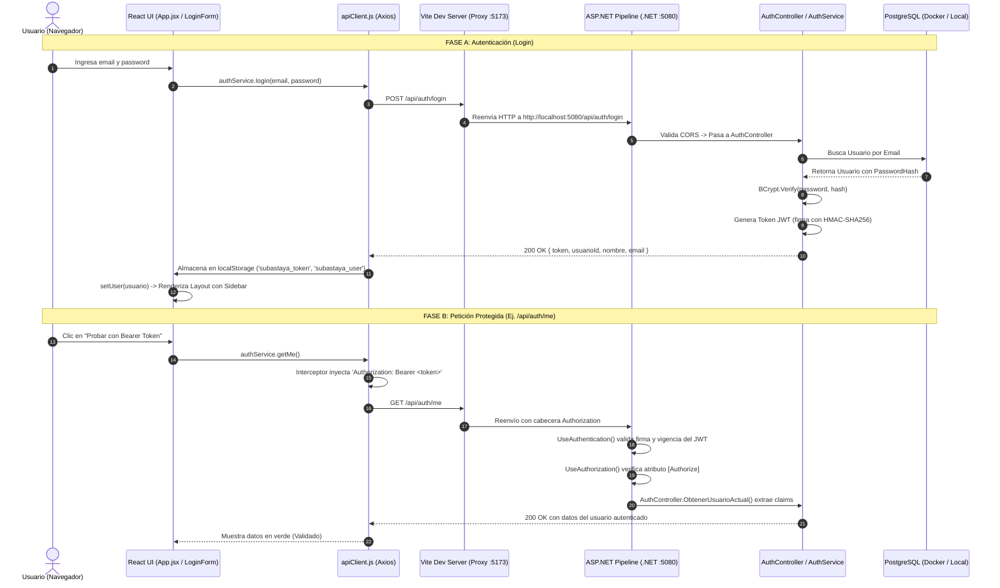

# Guía de Arquitectura: Cómo Leer el Flujo Frontend - Backend (SubastaYa)

Esta guía explica en detalle cómo funciona el circuito completo de comunicación, autenticación y consumo de datos entre el Frontend (React 19 + Vite + Tailwind v4 + Shadcn) y el Backend (.NET 10 Web API + EF Core + PostgreSQL).

---

## 1. Mapa Mental del Flujo de Datos

---

## 2. Los 5 Puntos Críticos del Flujo (Cómo leer el código)

### Punto 1: La Capa de Red (Proxy de Vite y CORS en .NET)
* **Dónde leerlo:**
  - Frontend: [vite.config.js](file:///home/fraan/Documents/Projects/SubastaYa/SubastaYaFront/vite.config.js) (sección `server.proxy`).
  - Backend: [Program.cs](file:///home/fraan/Documents/Projects/SubastaYa/SubastaYa/Program.cs) (sección `builder.Services.AddCors` y `app.UseCors`).
* **Cómo funciona:**
  - El frontend corre en `http://localhost:5173` y el backend en `http://localhost:5080`.
  - Cuando el frontend hace `axios.get('/api/...')`, el navegador cree que le está pidiendo datos al mismo puerto 5173. El servidor Vite intercepta `/api` en Node.js y reenvía el paquete a `localhost:5080`.
* **⚠️ Dónde prestar atención:**
  - **Orden de middlewares en .NET:** `app.UseCors()` **siempre** debe colocarse antes de `app.UseAuthentication()` y `app.UseAuthorization()`. Si se invierte, las peticiones `OPTIONS` (preflight) fallarán con error 401 antes de validar CORS.

---

### Punto 2: Generación y Validación de Contraseñas (Backend)
* **Dónde leerlo:**
  - [AuthService.cs](file:///home/fraan/Documents/Projects/SubastaYa/SubastaYa/Services/AuthService.cs)
  - [AuthController.cs](file:///home/fraan/Documents/Projects/SubastaYa/SubastaYa/Controllers/AuthController.cs)
  - [appsettings.json](file:///home/fraan/Documents/Projects/SubastaYa/SubastaYa/appsettings.json)
* **Cómo funciona:**
  1. `AuthService.LoginAsync()` busca el usuario por email normalizado.
  2. Ejecuta `BCrypt.Net.BCrypt.Verify(request.Password, usuario.PasswordHash)`. Esto compara la contraseña en texto plano con el salt y hash almacenados en la base de datos (creados originalmente en `DbSeeder.cs`).
  3. Si la verificación pasa, construye un `SecurityTokenDescriptor` con claims (`NameIdentifier`, `Name`, `Email`, `usuario_id`), firma con `HmacSha256` usando la clave de configuración y devuelve el string JWT.
* **⚠️ Dónde prestar atención:**
  - **Expiración:** Configurada en `appsettings.json` (`Jwt:ExpireMinutes: 1440` = 24 horas).
  - **Claims:** Los claims son metadatos que viajan dentro del token. El backend no necesita volver a consultar la base de datos para saber quién hizo la petición; lo extrae directamente de la firma criptográfica.

---

### Punto 3: El Cliente HTTP y los Interceptores (Frontend)
* **Dónde leerlo:**
  - [src/services/apiClient.js](file:///home/fraan/Documents/Projects/SubastaYa/SubastaYaFront/src/services/apiClient.js)
  - [src/services/authService.js](file:///home/fraan/Documents/Projects/SubastaYa/SubastaYaFront/src/services/authService.js)
* **Cómo funciona:**
  - `apiClient` es una instancia centralizada de Axios.
  - **Request Interceptor:** Antes de que salga **cualquier** petición (`GET`, `POST`, etc.), lee `localStorage.getItem('subastaya_token')`. Si existe, agrega el encabezado `Authorization: Bearer <token>`.
  - **Response Interceptor:** Si el backend responde `401 Unauthorized` (por ejemplo, porque el token expiró), borra automáticamente las credenciales de `localStorage` y dispara un evento global `window.dispatchEvent(new Event('auth:unauthorized'))`.
* **⚠️ Dónde prestar atención:**
  - **Normalización de errores:** `apiClient` extrae `error.response?.data?.mensaje` (el formato que usa tu backend .NET) y lo encapsula en un `new Error(mensaje)`. Así, en cualquier componente React podés hacer `try { ... } catch (err) { alert(err.message) }` y siempre tendrás un texto legible.

---

### Punto 4: Protección de Endpoints con `[Authorize]` en .NET
* **Dónde leerlo:**
  - [AuthController.cs](file:///home/fraan/Documents/Projects/SubastaYa/SubastaYa/Controllers/AuthController.cs#L51)
  - [Program.cs](file:///home/fraan/Documents/Projects/SubastaYa/SubastaYa/Program.cs#L24-L44)
* **Cómo funciona:**
  - Al decorar un método o controlador con `[Authorize]`, .NET ejecuta automáticamente el middleware `JwtBearerHandler`.
  - Valida:
    1. Que la firma coincida con `Jwt:Key`.
    2. Que el emisor sea `Jwt:Issuer` (`SubastaYaBackend`).
    3. Que la audiencia sea `Jwt:Audience` (`SubastaYaFrontend`).
    4. Que la fecha actual no supere la de expiración (`ClockSkew = TimeSpan.Zero`).
  - Si es válido, inyecta los claims en la propiedad `User` del controlador (`User.FindFirst(ClaimTypes.NameIdentifier)`).
* **⚠️ Dónde prestar atención:**
  - Si la petición no lleva el header `Authorization` o el token fue alterado, .NET devuelve `401 Unauthorized` **automáticamente sin entrar al cuerpo del método**.

---

### Punto 5: Ciclo de Vida en React (Login vs Layout con Sidebar)
* **Dónde leerlo:**
  - [src/App.jsx](file:///home/fraan/Documents/Projects/SubastaYa/SubastaYaFront/src/App.jsx)
  - [src/components/login-form.jsx](file:///home/fraan/Documents/Projects/SubastaYa/SubastaYaFront/src/components/login-form.jsx)
  - [src/components/app-sidebar.jsx](file:///home/fraan/Documents/Projects/SubastaYa/SubastaYaFront/src/components/app-sidebar.jsx)
  - [src/components/nav-user.jsx](file:///home/fraan/Documents/Projects/SubastaYa/SubastaYaFront/src/components/nav-user.jsx)
* **Cómo funciona:**
  1. En `App.jsx`, el estado inicial se obtiene con una función lazy: `useState(() => authService.getCurrentUser())`. Esto evita el "parpadeo" de la pantalla de login si el usuario ya tenía sesión iniciada.
  2. Si `!user`: Se renderiza únicamente el bloque `LoginForm` centrado en pantalla.
  3. Si `user`: Se renderiza el árbol completo envuelto en `SidebarProvider`, con `AppSidebar` y el panel de diagnóstico.
  4. Al pulsar "Cerrar sesión" en el avatar del sidebar (`NavUser`), se invoca `authService.logout()`, limpiando el estado y regresando instantáneamente a la pantalla de login.

---

## 3. Checklist de Puntos de Atención y Buenas Prácticas

> [!IMPORTANT]
> **1. Manejo del Secret Key en Producción**
> La clave en `appsettings.json` (`SubastaYaSuperSecretKeyForJwtAuthentication2026!`) sirve para desarrollo. En producción debe provenir de variables de entorno del sistema o Azure Key Vault, y nunca comitearse una clave productiva en el repositorio.

> [!TIP]
> **2. Cómo extender este flujo a nuevos módulos (Subastas y Billetera)**
> Ahora que `apiClient` ya inyecta el token automáticamente:
> - Para crear subastas (`POST /api/auctions`): ya no necesitarás pasar `VendedorId` hardcodeado si decorás el endpoint con `[Authorize]` y extraés el ID del vendedor con `User.FindFirst(ClaimTypes.NameIdentifier)`.
> - Para pujar (`POST /api/auctions/{id}/bids`): el `CompradorId` se puede obtener de la misma forma desde el token.

> [!WARNING]
> **3. Sincronización entre Pestañas**
> Si el usuario abre dos pestañas y cierra sesión en una, el token se borra de `localStorage`. Gracias al interceptor de respuesta en `apiClient`, si la otra pestaña intenta hacer una llamada protegida, recibirá un 401 y automáticamente redirigirá al login.

---

## 4. Guía Rápida de Troubleshooting (¿Qué hacer si falla algo?)

| Síntoma | Causa Probable | Solución |
| :--- | :--- | :--- |
| **Error de red / AxiosError** en el Ping | El backend de .NET no está corriendo en el puerto 5080. | Ejecutar `dotnet run` en la carpeta `SubastaYa`. Verificar que escuche en `http://localhost:5080`. |
| **400 Bad Request: "Credenciales inválidas"** | Email o contraseña mal escritos. | Usar `vendedor@test.com` o `comprador1@test.com` con la contraseña del seeder: `password12345`. |
| **401 Unauthorized** al tocar "Probar con Bearer Token" | El token no viajó o expiró. | Revisar en DevTools (pestaña Red / Headers) que la petición lleve `Authorization: Bearer eyJ...`. |
| **Error de CORS en la consola del navegador** | Se intentó llamar directamente a `5080` sin pasar por el proxy, o la política no coincidió. | Asegurarse de usar rutas relativas `/api/...` (gestionadas por el proxy de Vite). |
