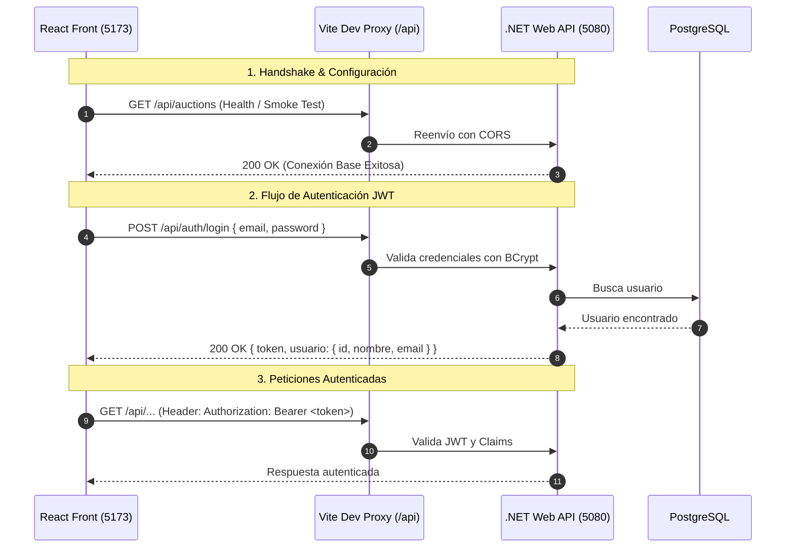

# Plan Base: Conexión Frontend - Backend con JWT (SubastaYa)

Este plan define los pasos concretos para dejar **100% operativa la infraestructura base de comunicación** entre el Frontend ([SubastaYaFront](file:///home/fraan/Documents/Projects/SubastaYa/SubastaYaFront)) y el Backend ([SubastaYa](file:///home/fraan/Documents/Projects/SubastaYa/SubastaYa)), incorporando **Autenticación con JWT** y postergando la implementación de los módulos de negocio (catálogo, subastas, billetera) para etapas posteriores.

---

## 1. Arquitectura Base de Comunicación y Auth



---

## 2. Hoja de Ruta de Implementación

### Fase 1: Capa de Red y Conectividad (Proxy & CORS)
- [x] **Configurar CORS en .NET ([Program.cs](file:///home/fraan/Documents/Projects/SubastaYa/SubastaYa/Program.cs)):**
  - Permitir origen `http://localhost:5173`, métodos y cabeceras completas.
- [x] **Configurar Proxy en Vite ([vite.config.js](file:///home/fraan/Documents/Projects/SubastaYa/SubastaYaFront/vite.config.js)):**
  - Redireccionar `/api` hacia `http://localhost:5080`.
- [x] **Variables de entorno ([.env](file:///home/fraan/Documents/Projects/SubastaYa/SubastaYaFront/.env)):**
  - Definir `VITE_API_URL=/api`.

---

### Fase 2: Implementación de Autenticación JWT en Backend (.NET)
- [x] **Paquete NuGet:**
  - Agregar `Microsoft.AspNetCore.Authentication.JwtBearer` a [SubastaYa.csproj](file:///home/fraan/Documents/Projects/SubastaYa/SubastaYa/SubastaYa.csproj).
- [x] **Configuración en `appsettings.json`:**
  - Clave secreta, emisor (`Issuer`) y audiencia (`Audience`).
- [x] **Servicio y Controlador de Autenticación:**
  - Crear DTOs: `LoginRequest` (`Email`, `Password`) y `LoginResponse` (`Token`, `UsuarioId`, `Nombre`, `Email`).
  - Crear `IAuthService` / `AuthService` para generar el token JWT con los claims (`NameIdentifier`, `Email`, `Name`) y validar contraseña con `BCrypt.Net`.
  - Crear `AuthController` con endpoint `POST /api/auth/login`.
- [x] **Middleware en `Program.cs`:**
  - Agregar `builder.Services.AddAuthentication(JwtBearerDefaults.AuthenticationScheme).AddJwtBearer(...)`.
  - Agregar `app.UseAuthentication()` antes de `app.UseAuthorization()`.

---

### Fase 3: Cliente HTTP e Interceptores en Frontend
- [x] **Instalación de Axios:**
  - Instalar `axios` en el frontend (`pnpm add axios`).
- [x] **Creación de `src/services/apiClient.js`:**
  - Instancia base con `baseURL: import.meta.env.VITE_API_URL || '/api'`.
  - **Interceptor de Request:** Inyectar automáticamente el header `Authorization: Bearer <token>` si existe un token guardado (en `localStorage` o memoria).
  - **Interceptor de Response:** Normalizar manejo de errores (`401 Unauthorized` para limpiar sesión, y extracción de mensajes de error de la API).
- [x] **Servicio de Autenticación (`src/services/authService.js`):**
  - Métodos base: `login(email, password)`, `logout()`, `getToken()`, `getCurrentUser()`.

---

### Fase 4: Smoke Test de Conexión y Auth con Bloques Shadcn
- [x] **Instalar bloques oficiales de Shadcn (usando `pnpm`):**
  ```bash
  pnpm dlx shadcn@latest add sidebar-08
  pnpm dlx shadcn@latest add login-01
  ```
- [x] **Estructura visual de prueba:**
  - **Login (`login-01`):** Formulario para ingreso real de credenciales (email y password manuales, validados contra el backend .NET con BCrypt). Al autenticarse con éxito, se guarda el JWT y se transiciona al layout del Sidebar.
  - **Sidebar (`sidebar-08`):** Layout principal con barra lateral donde se integra:
    - **Perfil de Usuario:** Nombre, email y botón de logout en el avatar.
    - **Panel Principal:** Card simple y elegante con saludo y el botón **"Probar conexión"**, que valida el token Bearer contra `/api/auth/me` y muestra el estado en un badge.

> [!NOTE]
> Con este enfoque logramos una UI prolija y modular utilizando los bloques estándar de Shadcn (`sidebar-08` y `login-01`), asegurando que la conexión y el flujo de tokens queden 100% testeados sin construir aún los módulos de negocio.
