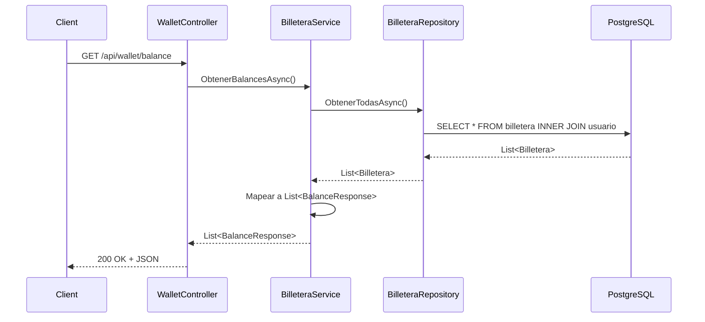

# Plan: `GET /api/wallet/balance` — Desglose de Saldos

## Objetivo
Implementar el endpoint `GET /api/wallet/balance` que devuelve el desglose de saldos de **todas** las billeteras: **Total**, **Retenido** y **Disponible**. Sin autenticación ni filtro por usuario (proyecto pedagógico).

## Flujo end-to-end



---

## Cambios Propuestos

6 archivos a crear, 1 a modificar.

---

### 1. DTO de Respuesta

#### [NEW] `Models/Dtos/Responses/BalanceResponse.cs`

```csharp
namespace SubastaYa.Models.Dtos.Responses;

public class BalanceResponse
{
    public int UsuarioId { get; set; }
    public string UsuarioNombre { get; set; } = string.Empty;
    public decimal SaldoTotal { get; set; }
    public decimal SaldoRetenido { get; set; }
    public decimal SaldoDisponible { get; set; }
}
```

> [!NOTE]
> Incluyo `UsuarioId` y `UsuarioNombre` para que en la respuesta se pueda distinguir de quién es cada billetera. Si preferís no exponer esos campos, sacalos y queda solo el trío de saldos.

---

### 2. Repository — Interface

#### [NEW] `Repositories/Interfaces/IBilleteraRepository.cs`

```csharp
using SubastaYa.Models.Entities;

namespace SubastaYa.Repositories.Interfaces;

public interface IBilleteraRepository
{
    Task<List<Billetera>> ObtenerTodasAsync();
}
```

---

### 3. Repository — Implementación

#### [NEW] `Repositories/BilleteraRepository.cs`

```csharp
using Microsoft.EntityFrameworkCore;
using SubastaYa.Data;
using SubastaYa.Models.Entities;
using SubastaYa.Repositories.Interfaces;

namespace SubastaYa.Repositories;

public class BilleteraRepository : IBilleteraRepository
{
    private readonly AppDbContext _context;

    public BilleteraRepository(AppDbContext context)
    {
        _context = context;
    }

    public async Task<List<Billetera>> ObtenerTodasAsync()
    {
        return await _context.Billeteras
            .Include(b => b.Usuario)
            .ToListAsync();
    }
}
```

> [!NOTE]
> El `.Include(b => b.Usuario)` es necesario para poder mapear el `UsuarioNombre` en el service. Sin el Include, la navigation property `Usuario` queda en `null`.

---

### 4. Service — Interface

#### [NEW] `Services/Interfaces/IBilleteraService.cs`

```csharp
using SubastaYa.Models.Dtos.Responses;

namespace SubastaYa.Services.Interfaces;

public interface IBilleteraService
{
    Task<List<BalanceResponse>> ObtenerBalancesAsync();
}
```

---

### 5. Service — Implementación

#### [NEW] `Services/BilleteraService.cs`

```csharp
using SubastaYa.Models.Dtos.Responses;
using SubastaYa.Repositories.Interfaces;
using SubastaYa.Services.Interfaces;

namespace SubastaYa.Services;

public class BilleteraService : IBilleteraService
{
    private readonly IBilleteraRepository _billeteraRepository;

    public BilleteraService(IBilleteraRepository billeteraRepository)
    {
        _billeteraRepository = billeteraRepository;
    }

    public async Task<List<BalanceResponse>> ObtenerBalancesAsync()
    {
        var billeteras = await _billeteraRepository.ObtenerTodasAsync();

        return billeteras.Select(b => new BalanceResponse
        {
            UsuarioId = b.UsuarioId,
            UsuarioNombre = b.Usuario.Nombre,
            SaldoTotal = b.SaldoTotal,
            SaldoRetenido = b.SaldoRetenido,
            SaldoDisponible = b.SaldoDisponible
        }).ToList();
    }
}
```

> [!TIP]
> Comparado con la versión anterior, acá no hay validación de "no encontrado" porque un listado vacío es un resultado válido (se devuelve `[]` con 200 OK). Mismo criterio que `ListarSubastas`.

---

### 6. Controller

#### [NEW] `Controllers/WalletController.cs`

```csharp
using Microsoft.AspNetCore.Mvc;
using SubastaYa.Models.Dtos.Responses;
using SubastaYa.Services.Interfaces;

namespace SubastaYa.Controllers;

[ApiController]
[Route("api/wallet")]
public class WalletController : ControllerBase
{
    private readonly IBilleteraService _billeteraService;

    public WalletController(IBilleteraService billeteraService)
    {
        _billeteraService = billeteraService;
    }

    [HttpGet("balance")]
    [ProducesResponseType(typeof(List<BalanceResponse>), StatusCodes.Status200OK)]
    public async Task<IActionResult> ObtenerBalances()
    {
        var resultado = await _billeteraService.ObtenerBalancesAsync();
        return Ok(resultado);
    }
}
```

> [!NOTE]
> Sin parámetros, sin try/catch — es el endpoint más limpio posible. Siempre devuelve 200.

---

### 7. Registro de DI

#### [MODIFY] `Program.cs`

Agregar 2 líneas después de las registraciones existentes:

```diff
 builder.Services.AddScoped<ISubastaRepository, SubastaRepository>();
 builder.Services.AddScoped<ISubastaService, SubastaService>();
+builder.Services.AddScoped<IBilleteraRepository, BilleteraRepository>();
+builder.Services.AddScoped<IBilleteraService, BilleteraService>();
```

No necesitás `using` adicionales (mismos namespaces).

---

## Resumen

| # | Archivo | Acción |
|---|---------|--------|
| 1 | `Models/Dtos/Responses/BalanceResponse.cs` | **Crear** |
| 2 | `Repositories/Interfaces/IBilleteraRepository.cs` | **Crear** |
| 3 | `Repositories/BilleteraRepository.cs` | **Crear** |
| 4 | `Services/Interfaces/IBilleteraService.cs` | **Crear** |
| 5 | `Services/BilleteraService.cs` | **Crear** |
| 6 | `Controllers/WalletController.cs` | **Crear** |
| 7 | `Program.cs` | **Modificar** (+2 líneas) |

## Orden de implementación

De abajo hacia arriba para que compile en cada paso:

1. **DTO** → 2. **Interface Repo** → 3. **Impl Repo** → 4. **Interface Service** → 5. **Impl Service** → 6. **Controller** → 7. **Program.cs**

## Verificación

```bash
# Build
dotnet build

# Test — respuesta esperada: array de billeteras con saldos
curl -s http://localhost:5000/api/wallet/balance | jq
```

Respuesta esperada:
```json
[
  {
    "usuarioId": 1,
    "usuarioNombre": "Juan",
    "saldoTotal": 1000.00,
    "saldoRetenido": 0.00,
    "saldoDisponible": 1000.00
  },
  {
    "usuarioId": 2,
    "usuarioNombre": "María",
    "saldoTotal": 500.00,
    "saldoRetenido": 100.00,
    "saldoDisponible": 400.00
  }
]
```
