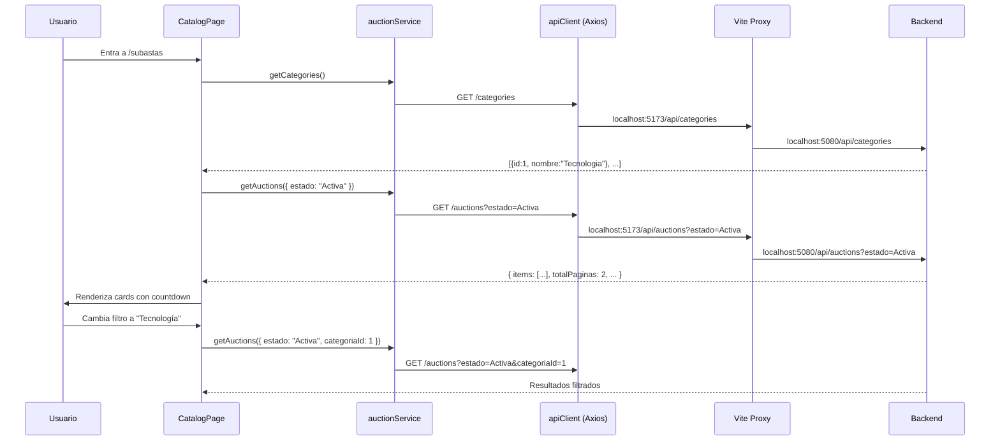

# Plan — Módulo 1: Catálogo y Exploración de Subastas

## Objetivo
Implementar la pantalla de exploración de subastas con filtros, búsqueda, paginación y cards informativas con countdown. Esto implica cambios en el backend (nuevo endpoint de categorías, filtros adicionales, ordenamiento) y en el frontend (router, servicio de subastas, página de catálogo, componentes).

## Requerimientos del PDF
> **Filtros y Búsqueda:** Por estado (Activas, Próximas, Finalizadas), categoría, rango de precios y ordenamiento (por menor tiempo restante o mayor puja).

> **Cards de Producto:** Imagen referencial, título, categoría, oferta más alta actual, cantidad de ofertas realizadas y un contador regresivo visible.

---

## User Review Required

> [!IMPORTANT]
> **Routing:** Actualmente no hay `react-router-dom` instalado. El plan incluye instalarlo y migrar la navegación del sidebar. Esto cambia la estructura de `App.jsx` significativamente — de un condicional simple a un sistema de rutas.

> [!IMPORTANT]
> **Scope del Módulo 1:** Este plan cubre SOLO el catálogo (listado + filtros). NO incluye la vista de detalle de subasta (eso sería Módulo 3: Sala de Subasta en Vivo). Al hacer click en una card, por ahora navegamos a la ruta `/subastas/:id` con un placeholder.

## Decisiones Confirmadas

> [!TIP]
> ✅ **Categorías ya disponible:** El endpoint `GET /api/categories` ya fue implementado por el compañero y mergeado a nuestra rama (`feature/auction-catalog`). No hace falta crearlo.

> [!TIP]
> ✅ **Estados separados:** Mostramos 4 filtros de estado: Activa, Programada, Finalizada, Desierta. Cada uno con su filtro específico.

> [!TIP]
> ✅ **Imágenes reales en Seeder:** Usamos URLs directas de Unsplash para cada una de las 5 subastas de prueba en `DbSeeder.cs`, más fallback visual en el frontend si falla la carga.

> [!TIP]
> ✅ **Filtros Backend faltantes:** Se implementan en `GET /api/auctions` el rango de precios (`precioMin`, `precioMax`), ordenamiento (`ordenamiento`: tiempo / mayor_puja) y se agrega `FechaInicio` a `SubastaListadoResponse`.

---

## Proposed Changes

### Componente 1: Backend — Seeder con Imágenes de Unsplash & DTO

#### [MODIFY] `Data/DbSeeder.cs`
Actualizar los valores de `UrlImagen`:
- Notebook Gamer: `https://images.unsplash.com/photo-1603302576837-37561b2e2302?w=600&auto=format&fit=crop&q=80`
- Figura de colección: `https://images.unsplash.com/photo-1607604276583-eef5d076aa5f?w=600&auto=format&fit=crop&q=80`
- Campera de cuero: `https://images.unsplash.com/photo-1551028719-00167b16eac5?w=600&auto=format&fit=crop&q=80`
- Bicicleta rodado 29: `https://images.unsplash.com/photo-1485965120184-e220f721d03e?w=600&auto=format&fit=crop&q=80`
- Teclado mecánico: `https://images.unsplash.com/photo-1587829741301-dc798b83add3?w=600&auto=format&fit=crop&q=80`

#### [MODIFY] `Models/Dtos/Responses/SubastaListadoResponse.cs`
Agregar propiedad `FechaInicio`:
```csharp
public DateTime FechaInicio { get; set; }
```

---

### Componente 2: Backend — Filtros de Precio y Ordenamiento en Subastas

El endpoint `GET /api/auctions` actual soporta `estado`, `categoriaId` y `busqueda`. Incorporamos: `precioMin`, `precioMax` y `ordenamiento`.

#### [MODIFY] `Controllers/AuctionsController.cs`
Recibir query params:
```csharp
[FromQuery] decimal? precioMin = null,
[FromQuery] decimal? precioMax = null,
[FromQuery] string? ordenamiento = null
```

#### [MODIFY] `Services/Interfaces/ISubastaService.cs` y `Services/SubastaService.cs`
Propagar parámetros hacia el repositorio y mapear `FechaInicio` al response.

#### [MODIFY] `Repositories/Interfaces/ISubastaRepository.cs` y `Repositories/SubastaRepository.cs`
Aplicar los filtros en la consulta IQueryable:
- Rango de precios: `query.Where(s => s.PrecioBase >= precioMin)` / `<= precioMax`
- Ordenamiento:
  - `"tiempo"` -> `query.OrderBy(s => s.FechaFin)` (menor tiempo restante primero)
  - `"mayor_puja"` -> `query.OrderByDescending(s => s.Pujas.Any() ? s.Pujas.Max(p => p.Monto) : s.PrecioBase)`
  - default -> `query.OrderByDescending(s => s.FechaFin)`

El `GET /api/auctions` actual soporta `estado`, `categoriaId` y `busqueda`. Faltan: **rango de precios** y **ordenamiento**.

#### [MODIFY] `AuctionsController.cs`

Agregar 3 query params nuevos:

```diff
  public async Task<IActionResult> ListarSubastas(
      [FromQuery] int pagina = 1,
      [FromQuery] int tamaño = 10,
      [FromQuery] string? estado = null,
      [FromQuery] int? categoriaId = null,
-     [FromQuery] string? busqueda = null)
+     [FromQuery] string? busqueda = null,
+     [FromQuery] decimal? precioMin = null,
+     [FromQuery] decimal? precioMax = null,
+     [FromQuery] string? ordenamiento = null)
```

Y pasar esos parámetros al service:

```diff
- var resultado = await _subastaService.ListarSubastasAsync(pagina, tamaño, estadoEnum, categoriaId, busqueda);
+ var resultado = await _subastaService.ListarSubastasAsync(pagina, tamaño, estadoEnum, categoriaId, busqueda, precioMin, precioMax, ordenamiento);
```

#### [MODIFY] `ISubastaService.cs`

```diff
  Task<PaginacionResponse<SubastaListadoResponse>> ListarSubastasAsync(
-     int pagina, int tamaño, EstadoSubasta? estado, int? categoriaId, string? busqueda);
+     int pagina, int tamaño, EstadoSubasta? estado, int? categoriaId, string? busqueda,
+     decimal? precioMin = null, decimal? precioMax = null, string? ordenamiento = null);
```

#### [MODIFY] `ISubastaRepository.cs`

```diff
  Task<(List<Subasta> Items, int TotalCount)> ListarSubastasAsync(
-     int pagina, int tamaño, EstadoSubasta? estado, int? categoriaId, string? busqueda);
+     int pagina, int tamaño, EstadoSubasta? estado, int? categoriaId, string? busqueda,
+     decimal? precioMin = null, decimal? precioMax = null, string? ordenamiento = null);
```

#### [MODIFY] `SubastaRepository.cs`

Agregar filtros de precio y ordenamiento:

```csharp
// Filtro por rango de precios (sobre PrecioBase)
if (precioMin.HasValue)
{
    query = query.Where(s => s.PrecioBase >= precioMin.Value);
}
if (precioMax.HasValue)
{
    query = query.Where(s => s.PrecioBase <= precioMax.Value);
}

// Ordenamiento
query = ordenamiento?.ToLower() switch
{
    "tiempo"     => query.OrderBy(s => s.FechaFin),          // Menor tiempo restante primero
    "mayor_puja" => query.OrderByDescending(s => s.Pujas.Any()
                        ? s.Pujas.Max(p => p.Monto) : 0),   // Mayor puja primero
    _            => query.OrderByDescending(s => s.FechaFin)  // Default: más recientes primero
};
```

#### [MODIFY] `SubastaService.cs`

Actualizar la firma para pasar los nuevos parámetros al repository.

#### [MODIFY] `SubastaListadoResponse.cs`

Agregar `FechaInicio` al DTO (necesario para mostrar "Inicia en X" en subastas Programadas):

```diff
  public class SubastaListadoResponse
  {
      public int Id { get; set; }
      public string Titulo { get; set; } = string.Empty;
      public string UrlImagen { get; set; } = string.Empty;
      public decimal PrecioBase { get; set; }
+     public DateTime FechaInicio { get; set; }
      public DateTime FechaFin { get; set; }
      public string Estado { get; set; } = string.Empty;
      public string CategoriaNombre { get; set; } = string.Empty;
      public int CantidadPujas { get; set; }
      public decimal? MontoActual { get; set; }
  }
```

---

### Componente 3: Frontend — Instalación de react-router-dom

```bash
pnpm add react-router-dom
```

---

### Componente 4: Frontend — Routing en App.jsx & Sidebar con Submenús Colapsables

#### [MODIFY] `src/App.jsx`

Refactorizar para usar `BrowserRouter`, `Routes` y `Route`. La estructura:

```
/              → Redirige a /subastas
/subastas      → Página de catálogo (Módulo 1: funcional al 100%)
```

Se remueve definitivamente la card de "Conexión y Diagnóstico". La aplicación entra directamente al Catálogo de Subastas una vez autenticado.

#### [MODIFY] `src/components/app-sidebar.jsx`

Actualizar `navItems` para incluir únicamente el módulo de **Subastas** con su submenú colapsable aprovechando la capacidad nativa de `NavMain` / `Collapsible`:

```javascript
const navItems = [
  {
    title: "Subastas",
    url: "/subastas",
    icon: <GavelIcon />,
    isActive: true, // Desplegado por defecto
    items: [
      {
        title: "Explorar Catálogo",
        url: "/subastas",
        isActive: true,
      },
      {
        title: "Publicar Subasta",
        url: "/subastas/crear",
        disabled: true, // Próximamente (Módulo 2)
      },
      {
        title: "Sala en Vivo",
        url: "/subastas/en-vivo",
        disabled: true, // Próximamente (Módulo 3)
      },
    ],
  },
]
```

#### [MODIFY] `src/components/nav-main.jsx`

Adaptar para usar `<Link>` de `react-router-dom` preservando las animaciones de `Collapsible` y soportando items deshabilitados con feedback visual limpio.

---

### Componente 5: Frontend — Servicio de Subastas

#### [NEW] `src/services/auctionService.js`

```js
import apiClient from './apiClient'

export const auctionService = {
  async getAuctions({ pagina = 1, tamaño = 10, estado, categoriaId, busqueda, precioMin, precioMax, ordenamiento } = {}) {
    const params = { pagina, tamaño }
    if (estado) params.estado = estado
    if (categoriaId) params.categoriaId = categoriaId
    if (busqueda) params.busqueda = busqueda
    if (precioMin) params.precioMin = precioMin
    if (precioMax) params.precioMax = precioMax
    if (ordenamiento) params.ordenamiento = ordenamiento

    const response = await apiClient.get('/auctions', { params })
    return response.data
  },

  async getAuction(id) {
    const response = await apiClient.get(`/auctions/${id}`)
    return response.data
  },

  async getCategories() {
    const response = await apiClient.get('/categories')
    return response.data
  },
}
```

---

### Componente 6: Frontend — Componentes del Catálogo

#### [NEW] `src/pages/CatalogPage.jsx`

Página principal del módulo. Estructura:

```
┌─────────────────────────────────────────────┐
│  Barra de búsqueda                          │
├──────┬──────┬──────────┬────────────────────┤
│Estado│Categ.│Precio    │  Ordenar por ▾     │
├──────┴──────┴──────────┴────────────────────┤
│                                             │
│  ┌────────┐  ┌────────┐  ┌────────┐        │
│  │ Card 1 │  │ Card 2 │  │ Card 3 │        │
│  └────────┘  └────────┘  └────────┘        │
│  ┌────────┐  ┌────────┐  ┌────────┐        │
│  │ Card 4 │  │ Card 5 │  │ Card 6 │        │
│  └────────┘  └────────┘  └────────┘        │
│                                             │
│         ◀ 1 2 3 ... ▶  (paginación)        │
└─────────────────────────────────────────────┘
```

**Estados internos:**
- `auctions` — Lista de subastas del backend
- `categories` — Lista de categorías (se carga una vez)
- `filters` — Objeto con: `{ estado, categoriaId, busqueda, precioMin, precioMax, ordenamiento }`
- `pagination` — Página actual, total páginas
- `loading` / `error`

**Flujo:**
1. Al montar, carga categorías + primera página de subastas.
2. Al cambiar un filtro, resetea a página 1 y recarga.
3. Al cambiar de página, recarga.

#### [NEW] `src/components/auction-card.jsx`

Card de subasta individual con:
- Imagen (con fallback si no carga)
- Badge de estado (verde=Activa, azul=Próxima, gris=Finalizada)
- Título
- Badge de categoría
- Precio actual o precio base (si no hay pujas)
- Cantidad de pujas
- **Countdown timer** (tiempo restante para subastas activas)
- Click → navega a `/subastas/:id`

#### [NEW] `src/hooks/use-countdown.js`

Hook custom para el countdown timer:

```js
export function useCountdown(targetDate) {
  const [timeLeft, setTimeLeft] = useState(calculateTimeLeft(targetDate))

  useEffect(() => {
    const timer = setInterval(() => {
      setTimeLeft(calculateTimeLeft(targetDate))
    }, 1000)
    return () => clearInterval(timer)
  }, [targetDate])

  return timeLeft  // { days, hours, minutes, seconds, isExpired }
}
```

#### [NEW] `src/components/countdown-badge.jsx`

Componente visual que muestra el countdown con estilos:
- **Verde:** > 5 minutos restantes
- **Amarillo:** 1-5 minutos restantes  
- **Rojo parpadeante:** < 1 minuto (zona crítica, como pide el PDF)
- **Gris:** Finalizada/Expirada

---

### Componente 7: Frontend — Componentes Shadcn adicionales

Necesitamos instalar algunos componentes UI que nos faltan:

```bash
pnpm dlx shadcn@latest add select        # Dropdown de filtros
pnpm dlx shadcn@latest add pagination    # Paginación (si existe en shadcn, sino manual)
```

> [!NOTE]
> Si `pagination` no existe como bloque de Shadcn, lo armamos manual con los `Button` que ya tenemos.

---

## Resumen de archivos

### Backend (6 archivos)
| Archivo | Acción |
|---|---|
| `Controllers/CategoriesController.cs` | **[NEW]** GET /api/categories |
| `Models/Dtos/Responses/CategoriaResponse.cs` | **[NEW]** DTO de categoría |
| `Controllers/AuctionsController.cs` | **[MODIFY]** Agregar precioMin, precioMax, ordenamiento |
| `Services/Interfaces/ISubastaService.cs` | **[MODIFY]** Actualizar firma |
| `Services/SubastaService.cs` | **[MODIFY]** Pasar params al repo |
| `Repositories/Interfaces/ISubastaRepository.cs` | **[MODIFY]** Actualizar firma |
| `Repositories/SubastaRepository.cs` | **[MODIFY]** Filtros de precio + ordenamiento |
| `Models/Dtos/Responses/SubastaListadoResponse.cs` | **[MODIFY]** Agregar FechaInicio |

### Frontend (8+ archivos)
| Archivo | Acción |
|---|---|
| `package.json` | **[MODIFY]** pnpm add react-router-dom |
| `src/App.jsx` | **[MODIFY]** Agregar BrowserRouter + Routes |
| `src/components/app-sidebar.jsx` | **[MODIFY]** URLs reales, quitar Diagnóstico |
| `src/components/nav-main.jsx` | **[MODIFY]** `<a>` → `<Link>` |
| `src/services/auctionService.js` | **[NEW]** Servicio de subastas |
| `src/pages/CatalogPage.jsx` | **[NEW]** Página principal del catálogo |
| `src/components/auction-card.jsx` | **[NEW]** Card de subasta |
| `src/hooks/use-countdown.js` | **[NEW]** Hook de countdown timer |
| `src/components/countdown-badge.jsx` | **[NEW]** Badge visual del countdown |

---

## Flujo de datos completo



---

## Verification Plan

### Build del Backend
```bash
cd /home/fraan/Documents/Projects/SubastaYa/SubastaYa
dotnet build
```
Esperado: 0 errors, 0 warnings.

### Build + Lint del Frontend
```bash
cd /home/fraan/Documents/Projects/SubastaYa/SubastaYaFront
pnpm build
pnpm lint
```
Esperado: 0 errors.

### Manual Verification
1. **Categorías:** `curl http://localhost:5080/api/categories` devuelve las 4 categorías.
2. **Filtro de precio:** `curl "http://localhost:5080/api/auctions?precioMin=10000&precioMax=30000"` devuelve solo subastas en rango.
3. **Ordenamiento:** `curl "http://localhost:5080/api/auctions?ordenamiento=mayor_puja"` ordena por mayor puja.
4. **Frontend:** Navegar a `http://localhost:5173/subastas`, verificar:
   - Cards se renderizan con imagen, título, categoría, precio, cantidad de pujas.
   - Countdown funciona y actualiza cada segundo.
   - Filtros de estado, categoría, búsqueda y precio funcionan.
   - Paginación funciona.
   - Sidebar muestra "Subastas" como activo.
   - Click en una card navega a `/subastas/:id`.
