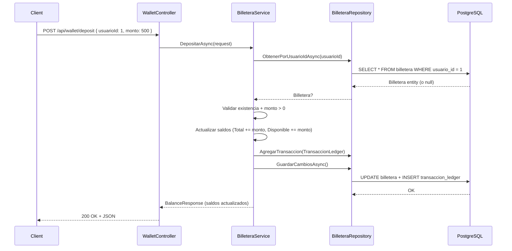

# Plan: `POST /api/wallet/deposit` — Acreditación de Fondos

## Objetivo
Implementar el endpoint `POST /api/wallet/deposit` que acredita fondos simulados en la billetera de un usuario. Actualiza `SaldoTotal` y `SaldoDisponible`, y registra el movimiento en `TransaccionLedger` con tipo `Deposito`.

## Contexto

A diferencia del GET, acá **no creamos nuevas capas desde cero**. Ya tenés el `WalletController`, `IBilleteraService`/`BilleteraService`, e `IBilleteraRepository`/`BilleteraRepository`. Solo agregamos métodos nuevos a cada capa y un DTO de request.

## Flujo end-to-end



---

## Cambios Propuestos

1 archivo nuevo (DTO) + 4 archivos a modificar (agregar métodos).

---

### 1. DTO de Request

#### [NEW] `Models/Dtos/Requests/DepositarRequest.cs`

```csharp
namespace SubastaYa.Models.Dtos.Requests;

public class DepositarRequest
{
    public int UsuarioId { get; set; }
    public decimal Monto { get; set; }
}
```

---

### 2. Repository — Agregar métodos

#### [MODIFY] `Repositories/Interfaces/IBilleteraRepository.cs`

Agregar 3 métodos al contrato existente:

```csharp
using SubastaYa.Models.Entities;

namespace SubastaYa.Repositories.Interfaces;

public interface IBilleteraRepository
{
    Task<List<Billetera>> ObtenerTodosAsync();                    // ← ya existe
    Task<Billetera?> ObtenerPorUsuarioIdAsync(int usuarioId);     // ← nuevo
    void AgregarTransaccion(TransaccionLedger transaccion);       // ← nuevo
    Task GuardarCambiosAsync();                                   // ← nuevo
}
```

> [!NOTE]
> `ObtenerPorUsuarioIdAsync` busca la billetera de un usuario específico. `AgregarTransaccion` agrega el registro al ledger sin persistir (igual que `AgregarSubasta` en el otro repo). `GuardarCambiosAsync` hace el `SaveChangesAsync` — separa el "agregar al contexto" del "persistir en DB".

#### [MODIFY] `Repositories/BilleteraRepository.cs`

Agregar las implementaciones:

```csharp
public async Task<Billetera?> ObtenerPorUsuarioIdAsync(int usuarioId)
{
    return await _context.Billeteras
        .FirstOrDefaultAsync(b => b.UsuarioId == usuarioId);
}

public void AgregarTransaccion(TransaccionLedger transaccion)
{
    _context.TransaccionLedgers.Add(transaccion);
}

public async Task GuardarCambiosAsync()
{
    await _context.SaveChangesAsync();
}
```

> [!IMPORTANT]
> Cuando llamás `GuardarCambiosAsync()`, EF Core persiste **todo lo pendiente en el contexto** en una sola transacción implícita: tanto la billetera modificada (que EF trackea por change tracking) como la transacción nueva. Esto es lo que garantiza que el saldo y el ledger estén siempre sincronizados — o se guardan los dos, o no se guarda ninguno.

---

### 3. Service — Agregar método

#### [MODIFY] `Services/Interfaces/IBilleteraService.cs`

```csharp
using SubastaYa.Models.Dtos.Requests;
using SubastaYa.Models.Dtos.Responses;

namespace SubastaYa.Services.Interfaces;

public interface IBilleteraService
{
    Task<List<BalanceResponse>> ObtenerBalanceAsync();                // ← ya existe
    Task<BalanceResponse> DepositarAsync(DepositarRequest request);   // ← nuevo
}
```

#### [MODIFY] `Services/BilleteraService.cs`

Agregar el método de depósito:

```csharp
public async Task<BalanceResponse> DepositarAsync(DepositarRequest request)
{
    // 1. Validar monto
    if (request.Monto <= 0)
    {
        throw new BusinessRuleException("El monto a depositar debe ser mayor a cero.");
    }

    // 2. Buscar billetera del usuario
    var billetera = await _billeteraRepository.ObtenerPorUsuarioIdAsync(request.UsuarioId);

    if (billetera == null)
    {
        throw new NotFoundException($"No se encontró billetera para el usuario con ID {request.UsuarioId}.");
    }

    // 3. Actualizar saldos
    billetera.SaldoTotal += request.Monto;
    billetera.SaldoDisponible += request.Monto;

    // 4. Registrar movimiento en el ledger
    var transaccion = new TransaccionLedger
    {
        BilleteraId = billetera.Id,
        Tipo = TipoTransaccion.Deposito,
        Monto = request.Monto,
        Fecha = DateTime.UtcNow,
        SubastaId = null
    };

    _billeteraRepository.AgregarTransaccion(transaccion);

    // 5. Persistir todo (billetera + transacción en una sola operación)
    await _billeteraRepository.GuardarCambiosAsync();

    // 6. Retornar saldos actualizados
    return new BalanceResponse
    {
        UsuarioId = billetera.UsuarioId,
        UsuarioNombre = billetera.Usuario?.Nombre ?? string.Empty,
        SaldoTotal = billetera.SaldoTotal,
        SaldoRetenido = billetera.SaldoRetenido,
        SaldoDisponible = billetera.SaldoDisponible
    };
}
```

> [!WARNING]
> Fijate que en el paso 3, **no se toca `SaldoRetenido`**. Un depósito suma a Total y Disponible. El Retenido solo cambia cuando se hace una puja (se retiene saldo) o se libera.

> [!NOTE]
> En el paso 6, `billetera.Usuario` podría ser `null` porque `ObtenerPorUsuarioIdAsync` no hace `.Include(b => b.Usuario)`. Tenés dos opciones: agregar el Include en ese método del repo, o usar `?? string.Empty`. Lo más prolijo es agregar el Include.

Recordá agregar los usings necesarios en `BilleteraService.cs`:
```csharp
using SubastaYa.Exceptions;
using SubastaYa.Models.Entities;
using SubastaYa.Models.Enums;
using SubastaYa.Models.Dtos.Requests;
```

---

### 4. Controller — Agregar endpoint

#### [MODIFY] `Controllers/WalletController.cs`

Agregar el método POST al controller existente:

```csharp
[HttpPost("deposit")]
[ProducesResponseType(typeof(BalanceResponse), StatusCodes.Status200OK)]
[ProducesResponseType(StatusCodes.Status400BadRequest)]
[ProducesResponseType(StatusCodes.Status404NotFound)]
public async Task<IActionResult> Depositar([FromBody] DepositarRequest request)
{
    try
    {
        var resultado = await _billeteraService.DepositarAsync(request);
        return Ok(resultado);
    }
    catch (NotFoundException ex)
    {
        return NotFound(new { mensaje = ex.Message });
    }
    catch (BusinessRuleException ex)
    {
        return BadRequest(new { mensaje = ex.Message });
    }
}
```

> [!NOTE]
> El patrón de try/catch es el mismo que usa [`CrearSubasta`](file:///home/fraan/Documents/Projects/SubastaYa/SubastaYa/Controllers/AuctionsController.cs#L50-L65) en el `AuctionsController`. `NotFoundException` → 404, `BusinessRuleException` → 400.

Agregar el using:
```csharp
using SubastaYa.Exceptions;
using SubastaYa.Models.Dtos.Requests;
```

---

## Resumen de cambios

| # | Archivo | Acción | Qué se agrega |
|---|---------|--------|---------------|
| 1 | `Models/Dtos/Requests/DepositarRequest.cs` | **Crear** | DTO con UsuarioId + Monto |
| 2 | `Repositories/Interfaces/IBilleteraRepository.cs` | **Modificar** | +3 métodos |
| 3 | `Repositories/BilleteraRepository.cs` | **Modificar** | +3 implementaciones |
| 4 | `Services/Interfaces/IBilleteraService.cs` | **Modificar** | +1 método |
| 5 | `Services/BilleteraService.cs` | **Modificar** | +método `DepositarAsync` con lógica de negocio |
| 6 | `Controllers/WalletController.cs` | **Modificar** | +endpoint POST |

> [!TIP]
> No necesitás tocar `Program.cs` esta vez — la DI ya está registrada del GET.

## Orden de implementación

1. **`DepositarRequest`** (DTO nuevo, sin dependencias)
2. **`IBilleteraRepository`** (agregar 3 métodos a la interface)
3. **`BilleteraRepository`** (implementar los 3 métodos)
4. **`IBilleteraService`** (agregar firma de `DepositarAsync`)
5. **`BilleteraService`** (implementar la lógica de depósito)
6. **`WalletController`** (agregar endpoint POST)

## Verificación

```bash
dotnet build
```

### Test con curl / Postman

```bash
# Depósito exitoso
curl -X POST http://localhost:5080/api/wallet/deposit \
  -H "Content-Type: application/json" \
  -d '{"usuarioId": 1, "monto": 500}' | jq

# Respuesta esperada:
# {
#   "usuarioId": 1,
#   "usuarioNombre": "...",
#   "saldoTotal": 1500.00,
#   "saldoRetenido": 0.00,
#   "saldoDisponible": 1500.00
# }

# Monto inválido → 400
curl -X POST http://localhost:5080/api/wallet/deposit \
  -H "Content-Type: application/json" \
  -d '{"usuarioId": 1, "monto": -100}' | jq

# Usuario inexistente → 404
curl -X POST http://localhost:5080/api/wallet/deposit \
  -H "Content-Type: application/json" \
  -d '{"usuarioId": 9999, "monto": 100}' | jq
```
