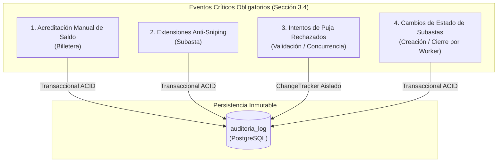

# Plan de Implementación: Audit Log en Eventos Críticos

Este documento detalla el plan técnico para la implementación completa y robusta de la auditoría de eventos críticos en **SubastaYa**, conforme a las exigencias de la **Sección 3.4** del enunciado de la cátedra (*Auditoría de Eventos y Trazabilidad*).

---

## 1. Alcance y Requisitos Normativos (Sección 3.4)

El sistema debe registrar de forma **inmutable** los eventos críticos del negocio y del sistema en la tabla `auditoria_log`.

### Matriz de Eventos Auditados

| Evento | Entidad | Acción (`Accion`) | Origen / Trigger | Detalle JSON (`DetalleJson`) | Estado Actual |
| :--- | :--- | :--- | :--- | :--- | :--- |
| **Acreditación de saldo** | `Billetera` | `AcreditacionManual` | `POST /api/wallet/deposit` | `{ Monto, SaldoTotalPrevio, SaldoTotalNuevo, SaldoDisponiblePrevio, SaldoDisponibleNuevo }` | ❌ **Pendiente** |
| **Extensión Anti-Sniping** | `Subasta` | `AntiSniping` | `POST /api/auctions/{id}/bids` (<60s) | `{ CompradorId, Monto, FechaFinPrevia, ExtensionMinutos, NuevaFechaFin }` | ✅ *En dev* |
| **Puja rechazada** | `Puja` | `PujaRechazada` | `POST /api/auctions/{id}/bids` (excepción) | `{ Motivo, Monto, CompradorIdSolicitado }` | ⚠️ *En dev (con bug FK)* |
| **Creación de subasta** | `Subasta` | `SubastaCreada` | `POST /api/auctions` | `{ VendedorId, CategoriaId, PrecioBase, IncrementoMinimo, FechaInicio, FechaFin, EstadoInicial }` | ❌ **Pendiente** |
| **Cierre con ganador** | `Subasta` | `SubastaFinalizada` | Background Worker | `{ GanadorId, MontoFinal, TotalPujas }` | ⏳ *En branch real-time* |
| **Cierre desierta** | `Subasta` | `SubastaDesierta` | Background Worker | `{ Mensaje }` | ⏳ *En branch real-time* |

---

## 2. Diagnóstico de Gaps y Compatibilidad de Ramas

> [!IMPORTANT]
> Se auditó la rama `origin/feature/real-time-notifications` frente a `dev`:
> 1. **Worker de Finalización:** Catriel implementó [`AuctionFinalizationWorker.cs`](file:///home/fraan/Documents/Projects/SubastaYa/SubastaYa/Workers/AuctionFinalizationWorker.cs) registrando `SubastaFinalizada` y `SubastaDesierta`. Dicha rama aún no está mergeada a `dev`.
> 2. **Billetera:** Ni `dev` ni `feature/real-time-notifications` auditan los depósitos.
> 3. **Bug de FK en Rechazos:** Ambas ramas tienen el riesgo de caída 500 si `compradorId` no existe en la base.

---

## 3. Fases de Ejecución

### Fase 1: Entorno de Trabajo y Rama Git
* **Acción:** Crear y cambiar a la rama `feature/audit-logs` partiendo de `dev`.
* **Comando:** `git checkout -b feature/audit-logs`

---

### Fase 2: Auditoría de Billetera (Acreditaciones Manuales)
* **Objetivo:** Cumplir con *"Acreditaciones manuales de saldo en las billeteras"* garantizando atomicidad (ACID) y consistencia en el control de concurrencia optimista (`Version`).
* **Modificaciones:**
  1. [`IBilleteraRepository.cs`](file:///home/fraan/Documents/Projects/SubastaYa/SubastaYa/Repositories/Interfaces/IBilleteraRepository.cs):
     * Declarar `void AgregarAuditoria(AuditoriaLog auditoria);`
  2. [`BilleteraRepository.cs`](file:///home/fraan/Documents/Projects/SubastaYa/SubastaYa/Repositories/BilleteraRepository.cs):
     * Implementar `_context.AuditoriaLogs.Add(auditoria);`
  3. [`BilleteraService.cs`](file:///home/fraan/Documents/Projects/SubastaYa/SubastaYa/Services/BilleteraService.cs) en `DepositarAsync`:
     * Capturar saldos previos (`SaldoTotal`, `SaldoDisponible`).
     * Aplicar el incremento e incrementar `billetera.Version++`.
     * Crear y encolar `AuditoriaLog`:
       * `Entidad = nameof(Billetera)`
       * `EntidadId = billetera.Id`
       * `Accion = "AcreditacionManual"`
       * `UsuarioId = billetera.UsuarioId`
       * `Fecha = DateTime.UtcNow`
       * `DetalleJson = JsonSerializer.Serialize(new { Monto, SaldoTotalPrevio, SaldoTotalNuevo, SaldoDisponiblePrevio, SaldoDisponibleNuevo })`
     * Llamar a `GuardarCambiosAsync()`, persistiendo billetera, ledger y auditoría en una única transacción atómica.

---

### Fase 3: Blindaje de Rechazos de Puja y Transaccionalidad
* **Objetivo:** Cumplir con *"Intentos de puja rechazados por concurrencia o validaciones de negocio críticas"* sin comprometer la integridad ni generar errores no controlados.
* **Problemas a resolver:**
  * **FK Constraint:** [`AuditoriaLog.UsuarioId`](file:///home/fraan/Documents/Projects/SubastaYa/SubastaYa/Models/Entities/AuditoriaLog.cs#L9) tiene clave foránea hacia `usuario(id)`. Si el comprador no existe (`NotFoundException`), pasar `request.CompradorId` causaría un error 500 no controlado por PostgreSQL.
  * **Rollback de entidades en memoria:** Si una regla de negocio falla después de modificar entidades del `DbContext` (por ejemplo tras descontar temporalmente saldo), esas entidades sucias no deben guardarse al persistir el log de rechazo.
* **Modificaciones:**
  1. [`PujaRepository.cs`](file:///home/fraan/Documents/Projects/SubastaYa/SubastaYa/Repositories/PujaRepository.cs) / [`IPujaRepository.cs`](file:///home/fraan/Documents/Projects/SubastaYa/SubastaYa/Repositories/Interfaces/IPujaRepository.cs):
     * Agregar método `void LimpiarRastreador()` que ejecute `_context.ChangeTracker.Clear();`
  2. [`PujaService.cs`](file:///home/fraan/Documents/Projects/SubastaYa/SubastaYa/Services/PujaService.cs):
     * En `RegistrarRechazoAsync`:
       * Ejecutar `_pujaRepository.LimpiarRastreador();` antes de crear el log.
       * Verificar si el usuario existe antes de asignar `auditoria.UsuarioId = usuarioExiste ? request.CompradorId : null`.
       * Registrar en el JSON el motivo, el monto y el `CompradorIdSolicitado`.

---

### Fase 4: Auditoría de Cambios de Estado en Subastas
* **Objetivo:** Cubrir el ciclo de vida completo de estados (`Programada`, `Activa`, `Finalizada`, `Desierta`).
* **Modificaciones:**
  1. [`ISubastaRepository.cs`](file:///home/fraan/Documents/Projects/SubastaYa/SubastaYa/Repositories/Interfaces/ISubastaRepository.cs) y [`SubastaRepository.cs`](file:///home/fraan/Documents/Projects/SubastaYa/SubastaYa/Repositories/SubastaRepository.cs):
     * Agregar `void AgregarAuditoria(AuditoriaLog auditoria);`
  2. [`SubastaService.cs`](file:///home/fraan/Documents/Projects/SubastaYa/SubastaYa/Services/SubastaService.cs) en `CrearSubastaAsync`:
     * Registrar `AuditoriaLog` con `Accion = "SubastaCreada"` y el estado inicial establecido (`Programada`).
  3. **Compatibilidad con Worker:** Las acciones usadas coincidirán exactamente con las de la rama de Catriel (`"SubastaFinalizada"` y `"SubastaDesierta"`).

---

## 4. Estrategia de Verificación y Testing

1. **Compilación estricta:** `dotnet build` con 0 advertencias y 0 errores.
2. **Prueba de Depósito:**
   * Invocar `POST /api/wallet/deposit` con monto $10.000.
   * Verificar actualización de `billetera`, inserción en `transaccion_ledger` y registro en `auditoria_log` con `Accion: AcreditacionManual`.
3. **Prueba de Rechazo con Usuario Inexistente:**
   * Invocar `POST /api/auctions/{id}/bids` con un `compradorId = 999999`.
   * Verificar respuesta `404 Not Found` limpia (no 500) y registro en `auditoria_log` con `UsuarioId = null` y motivo en JSON.
4. **Prueba de Anti-Sniping:**
   * Ofertar sobre la subasta semilla que vence en < 2 minutos.
   * Verificar extensión de 2 minutos y registro en `auditoria_log` con `Accion: AntiSniping`.
