# Plan de Implementación: Prueba de Concurrencia en Postman (Stress Test)

## Descripción del Objetivo

El enunciado del Trabajo Práctico (*Sección 4.1*) exige:
> *"Prueba de Concurrencia (Stress Test): El documento debe incluir una explicación breve (puede ser un bloque de código, un script de bash con curl, o exportación de Postman/JMeter) que demuestre cómo el equipo testeó la concurrencia optimista. Se debe probar que si se envían dos peticiones de puja idénticas en el mismo milisegundo, la base de datos registra solo una y rechaza la otra (ej. retornando HTTP 409 Conflict)."*

Los objetivos de esta etapa son:
1. **Creación del directorio y archivo Postman en `StressTest/`:**
   Ubicar la colección exportable en [`StressTest/SubastaYa_Stress_Test.postman_collection.json`](file:///home/fraan/Documents/Projects/SubastaYa/StressTest/SubastaYa_Stress_Test.postman_collection.json).
2. **Script de Concurrencia en Postman:**
   Implementar el script asíncrono con `Promise.all` y `pm.sendRequest` que dispara en simultáneo dos peticiones idénticas de puja al mismo milisegundo.
3. **Validación Automática y Visualización:**
   - Validar mediante `pm.test` que una solicitud responde con **`201 Created`** y la concurrente con **`409 Conflict`**.
   - Renderizar una tabla en **Postman Visualizer** que exponga el resultado de cada solicitud en color verde y rojo.
4. **Procedimiento de Reset de Base de Datos y Ejecución:**
   Incluir el comando para reiniciar la base de datos a su estado semilla inicial (`docker compose down -v && docker compose up -d db`) para que la prueba sea 100% reproducible tantas veces como el docente lo requiera.
5. **Documentación Técnica:**
   Actualizar la sección de control de concurrencia en [README.md](file:///home/fraan/Documents/Projects/SubastaYa/README.md).

---

## Aclaración sobre Códigos HTTP (201 Created vs 409 Conflict)

> [!NOTE]
> En la arquitectura RESTful de SubastaYa, la creación exitosa de un recurso (`POST /api/auctions/{id}/bids`) devuelve formalmente **`201 Created`** con los datos de la nueva puja, mientras que la colisión de concurrencia en la base de datos (*Optimistic Locking* por versión) es capturada como `DbUpdateConcurrencyException` y responde con **`409 Conflict`**.

---

## Flujo de Concurrencia en la Base de Datos

```mermaid
sequenceDiagram
    autonumber
    actor Postman as Postman (Promise.all)
    participant API as AuctionsController (/api/auctions/1/bids)
    participant Service as PujaService & Repository
    participant DB as PostgreSQL (Version Token)

    rect rgb(20, 30, 50)
    Note over Postman, DB: Mismo Milisegundo (t0)
    Postman->>API: Request A: CompradorId=3, Monto=50000
    Postman->>API: Request B: CompradorId=3, Monto=50000
    end

    API->>Service: Procesa Request A (lee Version=0)
    API->>Service: Procesa Request B (lee Version=0)

    Service->>DB: Request A: UPDATE subasta SET version=1 WHERE id=1 AND version=0
    DB-->>Service: 1 fila afectada (OK)
    Service-->>API: Puja creada
    API-->>Postman: 201 Created (Puja Registrada con éxito)

    Service->>DB: Request B: UPDATE subasta SET version=1 WHERE id=1 AND version=0
    DB-->>Service: 0 filas afectadas -> DbUpdateConcurrencyException
    Service-->>API: ConcurrencyConflictException
    API-->>Postman: 409 Conflict (Rechazada por conflicto de concurrencia)
```



---

## Cambios Propuestos

### 1. Directorio y Colección Postman

#### [NEW] [StressTest/SubastaYa_Stress_Test.postman_collection.json](file:///home/fraan/Documents/Projects/SubastaYa/StressTest/SubastaYa_Stress_Test.postman_collection.json)
Creación de la colección oficial Postman v2.1.0 dentro del directorio `StressTest/` que incluirá:
* **Variables preconfiguradas:**
  * `baseUrl`: `http://localhost:5080`
  * `subastaId`: `1` (Subasta activa estándar sembrada por `DbSeeder`)
  * `compradorId`: `3` (`comprador2@test.com`, con saldo disponible de $145.000)
  * `monto`: `50000` (Monto superador a la puja líder de $45.000)
* **Request 1:** `GET /api/auctions/{{subastaId}}` (Inspección previa del estado y versión inicial).
* **Request 2:** `Stress Test: 2 Pujas Simultaneas (201 vs 409)`
  * **Pre-request Script:**
    Dispara dos peticiones HTTP idénticas en paralelo al mismo milisegundo mediante `Promise.all`:
    ```javascript
    const baseUrl = pm.variables.get("baseUrl") || "http://localhost:5080";
    const subastaId = pm.variables.get("subastaId") || 1;
    const compradorId = Number(pm.variables.get("compradorId") || 3);
    const monto = Number(pm.variables.get("monto") || 50000);

    const payload = {
        url: `${baseUrl}/api/auctions/${subastaId}/bids`,
        method: 'POST',
        header: { 'Content-Type': 'application/json' },
        body: {
            mode: 'raw',
            raw: JSON.stringify({ compradorId: compradorId, monto: monto })
        }
    };

    const req1 = new Promise((resolve) => {
        pm.sendRequest(payload, (err, res) => {
            resolve({ name: "Petición A", error: err, status: res ? res.code : 500, body: res ? res.json() : null });
        });
    });

    const req2 = new Promise((resolve) => {
        pm.sendRequest(payload, (err, res) => {
            resolve({ name: "Petición B", error: err, status: res ? res.code : 500, body: res ? res.json() : null });
        });
    });

    Promise.all([req1, req2]).then(([resA, resB]) => {
        pm.globals.set("stressTestResults", JSON.stringify([resA, resB]));
    });
    ```
  * **Tests Script:**
    Aserciones automáticas en `pm.test` y visualizador en `pm.visualizer.set(...)`:
    ```javascript
    const results = JSON.parse(pm.globals.get("stressTestResults") || "[]");
    const resA = results[0];
    const resB = results[1];

    pm.test("Manejo de Concurrencia: Una petición debe registrarse (201 Created) y la otra rechazarse (409 Conflict)", function () {
        const statuses = [resA.status, resB.status].sort();
        pm.expect(statuses).to.eql([201, 409]);
    });

    pm.test("La petición en conflicto (409) debe contener el mensaje descriptivo", function () {
        const conflicto = [resA, resB].find(r => r.status === 409);
        pm.expect(conflicto).to.not.be.undefined;
        pm.expect(conflicto.body).to.have.property("mensaje");
    });
    ```

---

### 2. Documentación en el Repositorio

#### [MODIFY] [README.md](file:///home/fraan/Documents/Projects/SubastaYa/README.md)
Actualizar la sección `## Control de Concurrencia`:
* Procedimiento para reiniciar la base de datos limpia antes de la prueba:
  ```bash
  docker compose down -v && docker compose up -d db
  dotnet run --project SubastaYa/SubastaYa.csproj
  ```
* Pasos para importar y ejecutar la colección desde `StressTest/SubastaYa_Stress_Test.postman_collection.json`.
* Explicación del script y de los resultados esperados (201 Created vs 409 Conflict).

---

## Plan de Verificación

1. Resetear la base de datos con `docker compose down -v && docker compose up -d db`.
2. Iniciar el backend con `dotnet run --project SubastaYa/SubastaYa.csproj`.
3. Ejecutar la prueba de estrés concurrente y validar la recepción de `201 Created` y `409 Conflict`.
4. Verificar en PostgreSQL que en `auditoria_log` se haya asentado el rechazo por colisión.
5. Comprobar que el archivo `StressTest/SubastaYa_Stress_Test.postman_collection.json` sea un JSON válido e importable.
